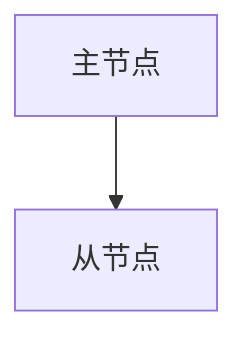
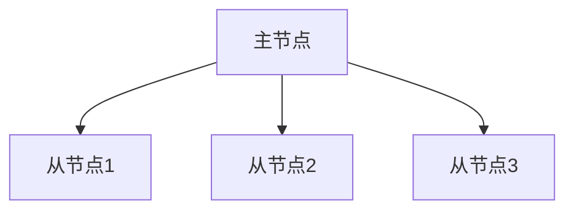
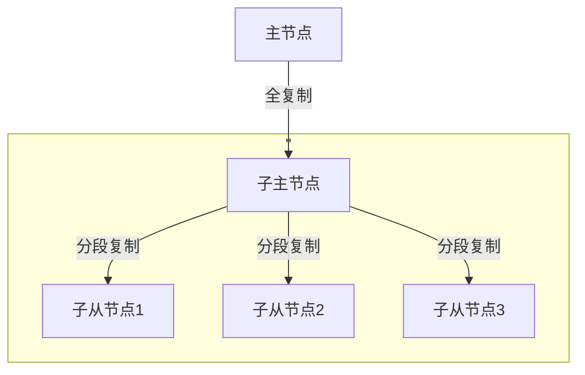
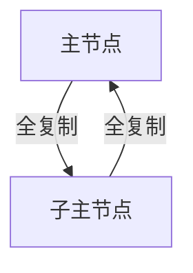

# Mysql主从复制


# 1. 前提 
- 需要多个实例  
- 每台实例`server_id`不同
- 需要开启二进制日志  
- 主库需要提供复制相关的用户权限(`replication slave`) 
- 从库需要将和主库相差的数据进行追加,一般先备份主库数据恢复到从库,然后在进行同步  
- 从库应该从恢复之后的时间点开始自动从主库获取最新的二进制日志  

# 2. 复制中的线程 
- 主库 
  - `Dump thread`: 在复制过程中,主库发送二进制日志的线程  
  - `binlog`文件  : 主库的二进制文件 
- 从库 
  - `IO thread`  : 向主库请求二进制日志,并接收二进制日志的线程  
  - `SQL thread` : 执行请求过来的二进制的线程  
  - `relaylog`   : 中继日志,存储请求过来的二进制日志 
  - `master.info`: 从库连接主库的重要参数(`user`,`passwd`,`ip`,`port`);上次获取过的主库的二进制日志位置 
  - `relay-log.info`: 存储从库`SQL`线程已经执行过的`relaylog`日志位置  

# 3. 主从复制原理
&emsp;&emsp;从库通过`IO线程`,读取`master.info`中的信息,获取到连接及上次请求主库的`binlog`的位置,然后`IO线程`使用获取到的连接连接到主库,主库获取到从库发来的位置信息和现有二进制日志进行对比,如果有新二进制日志,会通过`dump thread`发送给相关信息给从库,从库通过`IO线程`,接受主库发来的二进制日志后,存储到`TCP/IP`缓存中,并返回`ACK`确认给主库,主库收到`ACK`后,就认为任务复制完成了,可以继续其他工作。从库此时将更新`master.info`的二进制位置信息,`IO线程`会将`TCP/IP`缓存中的日志，会存储到`relay-log`日志文件中。然后`SQL线程`读取`relay-log.info`上次执行到的日志位置(此位置信息不一定与`binlog`日志位置相同),以这个日志位置为起点继续执行`relay-log`日志。`SQL线程`执行完成所有`relay`之后，会更新`relay-log.info`信息为新的位置信息。（至此一次复制完成）

# 4. 主从复制实践  
## 4.1. my.cnf 
```ini
# 禁用dns解析(只能使用ip)
skip-name-resolve

# 二进制日志控制 
server_id = 10    # 每个节点id不同 
log-bin = /data/mysql57/3307/binlog/mysql-bin
binlog_format = row
```
## 4.2. 备份 
```bash
$> mysqldump --defaults-file=/data/mysql57/3307/etc/my.cnf -A -R -B --triggers --master-data=2 --single-transaction > /tmp/aa.sql 
$> sed -n '22p' /tmp/aa.sql 
-- CHANGE MASTER TO MASTER_LOG_FILE='mysql-bin.000004', MASTER_LOG_POS=596; 

```

## 4.3. 授权 
```bash
$> grant replication slave on *.* to repl@'10.0.2.%' identified by 'gC74lgK9sSkzwBbrztd3'; 
$> flush privileges;
```

## 4.4. 备库导入数据 
```bash
$> mysql < /tmp/aa.sql 
```

## 4.5. 备库指定与主库的同步信息并启动同步
```sql
--- 指定同步连接信息(从库) 
mysql> change master to MASTER_HOST='10.0.2.25',
  MASTER_USER='repl',
  MASTER_PASSWORD='gC74lgK9sSkzwBbrztd3',
  MASTER_PORT=3307,
  MASTER_LOG_FILE='mysql-bin.000004',
  MASTER_LOG_POS=596,
  MASTER_CONNECT_RETRY=3;

--- 若初次搭建则(或从0开始全同步)
mysql> change master to MASTER_HOST='10.0.2.25',
  MASTER_USER='repl',
  MASTER_PASSWORD='gC74lgK9sSkzwBbrztd3',
  MASTER_PORT=3307,
  MASTER_AUTO_POSITION=1;

--- 启动同步 
mysql> start slave
--- 查看启动状态 
mysql> show slave status\G 
```
## 4.6. 主从状态信息介绍  
```bash
mysql> show slave status\G 
Slave_IO_Running              | Yes
Slave_SQL_Running             | Yes
## 最后一次IO的错误号码 
Last_IO_Errno                 | 0
## 最后一次IO的错误信息
Last_IO_Error                 | 
## 最后一次SQL的错误号码
Last_SQL_Errno                | 0
## 最后一次SQL的错误信息
Last_SQL_Error                | 
## 从库(同步)落后于主库的秒数
Seconds_Behind_Master         | 0
```
### 4.6.1. IO线程故障  
1. 主库连接不上: 防火墙、网络、连接信息错误(`ip`、`passwd`、`port`、`user`)、域名解析(`skip-name-resolve`)  
  -  解决方案: 
  ```sql
    mysql> stop slave;
    mysql> reset slave all;
    mysql> change master to ....;
    mysql> start slave;
  ```
2. 主库二进制日志文件丢失或损坏  
  - 解决方案: 重新备份恢复，在重新构建主从 

#### 4.6.1.1. 案例1
- 主从同步出现IO故障。导致原因，主库修改了端口号 
- 解决方案: 
  - 从库 `slow slave status\G`，确认故障 
  - 记录`Master_Log_File`和`Read_Master_Log_Pos`值 
  - `stop slave`
  - `reset slave all`
  - `change master to ...`
  - `start slave `
#### 4.6.1.2. 案例2 
- 主库的二进制日志被清理(1.`reset master`;2.binlog文件找不到/损坏/断节/物理删除/名字被修改等),从库请求日志出现`Slave_IO_Running: No`(`Last_IO_Error: xxxx could not find next log;the first evnet 'mysql-bin.xxxxx'`) 
- 解决方案: 
  - 使用备份恢复，重新初始化主从 
  
### 4.6.2. SQL 线程故障  
1. 执行`replaylog`日志新事件时,比如增加、删除库或数据时，从库已经存在或已经丢失了将要操作的数据 
  - 解决方案: 
  ```bash
    ## 1. 直接重建主从同步(推荐)
    ## 2. 一切以主库为准，创建失败时候删除从库多余的重启同步即可
    ## 3. 执行忽略操作(此操作有一定风险，出非明确知道在干什么，否则不建议使用)
    mysql> stop slave;
    mysql> set global sql_slave_skip_counter = 1; ## 将同步移动至下一个操作，如果多次不同步，可重复操作此项
    mysql> start slave;
    ## 4. 同3,只是在配置文件中忽略对应编码 
    $> vim my.cnf
    slave-skip-errors = 1032,1062,1007 
    ## 5. 为防止SQL线程故障，一般会设置从库只读(只针对普通用户)
    mysql> set global read_only=1;  ## $> my.cnf: read_only=1   
  ```

## 4.7. 延迟同步(故障) 
- `show slave status\G`
  - `Seconds_Behind_Master`: 主从延时时间(s)

### 4.7.1. 如何避免延迟同步
1. `sync_binlog=1`,0(默认):事务提交不立即写入磁盘，靠操作系统判断什么时候写入;1:每次提交事务都立即刷新binlong到磁盘;   

2. 主库大事务很多，拆分为小事务,多事务隔离  
3. 主库并发事务很多，使用多(sql)线程复制，针对不同库的事务来进行并发(有局限性)

3. 使用多级主从，分库分表架构  

4. 将`binlog|relaylog`放到高性能(`ssd`)磁盘上

5. 主备硬件尽量一致  

6. 从库越多，压力越大(dump 线程压力越大)

7. sql 线程慢 
  - 默认只有一个sql线程，从库中的事务都是一个一个来执行的 
  - 如果主库的并发事务很多和大事务，都会造成从库延时
  - 多(sql)线程复制，有局限性，针对不同库的事务来进行并发

## 4.8. 延迟同步(高级)
### 4.8.1. 逻辑损坏
- 延迟从库：从库落后于主库一段时间
  - SQL线程延时，数据已经写入到relaylog，SQL线程慢点执行 
  ```sql
  -- 从库执行 
  mysql> stop slave ; 
  mysql> CHANGE MASTER TO MASTER_DELAY = 3600; -- 建议3-6小时  
  mysql> start slave ; 
  ```
- 案例: 主库误操作，删库 
  1. 停止主库业务
  2. 立即停止从库SQL线程 `stop slave sql_thread;`
  3. 手工模拟sql线程工作，并截止到误操作之前 
    - 读取relay-log.info,获取到上次执行到的位置,作为继续执行relay-log的起点，分析relay-log内容，获取到误操作的位置点，截取这段日志，恢复到从库
    - 找到起点位置`show slave status\G`,`Relay_Log_file:db01-relay-bin.000002`;`Relay_Log_Pos:283` 
    - 找到误删除的位置，`show relaylog events in 'db01-relay-bin.000002'`,找到误删行的`Pos`值
    - 截取同步日志 `mysqlbinlog --start-position=283 --stop-position=693 db01-relay-bin.000002 > relay.sql`
    - 恢复relaylog
  4. 切换从库为主库 

## 4.9. 过滤复制
从库只想复制主库的那些库 
```bash
## 控制 my.cnf (不建议在主库进行设置,建议在从库进行设置)
## 白名单(在此当中的才会复制)
--replicate-do-db = test 
--replicate-do-table = test.t1 
--replicate-wild-do-table = test.t% 

## 黑名单(在此中的将不会复制)
--replicate-ignore-db = test
--replicate-ignore-table = test.t1 
--replicate-wild-ignore-table = test.t%

```

## 4.10. 半同步复制
- 尽可能保证主从数据一致性问题，牺牲主库一定的业务性能。实现过程，保证IO线程将日志从TCP/IP缓存，写入到relaylog才会返回ACK给主库。因此回阻塞主库的commit操作，这里会有个超时时间，10秒，如果从库还没有返回ACK，将会强制切换为一部复制过程。
```sql 
-- 主执行 加载插件(默认就有该组建)
INSTALL PLUGIN rpl_semi_sync_master SONAME 'semisync_master.so';
-- 从执行 加载插件(默认就有该组建)
mysql> INSTALL PLUGIN rpl_semi_sync_slave SONAME 'semisync_slave.so';
-- 查看是否加载成功 
mysql> show plugins;

-- 主启动 
mysql> SET GLOBAL rpl_semi_sync_master_enabled = 1;
-- 从启动 
mysql> SET GLOBAL rpl_semi_sync_slave_enabled = 1;

-- 重启从库上的IO线程 
mysql> stop slave io_thread;
mysql> start slave io_thread;

-- 查看主/备是否在运行 
mysql> show status like 'Rpl_semi_sync_master_status';
mysql> show status like 'Rpl_semi_sync_slave_status';

--- 默认情况下,到达10秒还没有返回ack,从中关系自动切换为普通复制 
rpl_semi_sync_master_timeout | 10000 

```

## 4.11. 主从复制GTID(5.6以上才有)
对于二进制日志中，每提交的一个事务都有一个全局的唯一编号，多主从一样，全局唯一，在处理恢复的时候，就可以只读取缺失的GIID事务
- GTID == source_id == transaction_id 
- 什么是server_id 
  - source_id 也叫server_uuid，默认是在数据库第一次启动时自动生成(/pathto/data/auto.cnf),手动删除后重启数据库可重新生成.
- GTID 复制要求必须是连续性事务 

```bash
## 启用GTID,不启用则为普通复制 
gtid-mode=on 
## 强制GTID的一致性 
enforce-gtid-consistency=true
## slave 强制刷新从库的二进制日志 
log-slave-updates=1
```
### 4.11.1. GTID 从库误写入操作处理
- 注入空事务的方法:
```sql
mysql> stop slave;
mysql> set gtid_next='xxxxxxxx-xxxx-xxxx-xxxx-xxxxxxxxxxxx:2'; --gtid_next 为slave sql thread 报错的GTID，或者是想要跳过的gtid
mysql> begin;commit;
mysql> set gtid_next='AUTOMATIC';
mysql> start slave 
```
- 最好的解决方案是：重新构建主从环境

### 4.11.2. 构建一主2从的GTID的复制环境  
```sql
-- 主库创建复制用户
$> reset master;
$> grant replication slave on *.* to repl@'10.0.2.%' identified by 'gC74lgK9sSkzwBbrztd3'; 
$> flush privileges;

-- 从库连接 
$> reset master;
mysql> change master to MASTER_HOST='10.0.2.25',
  MASTER_USER='repl',
  MASTER_PASSWORD='gC74lgK9sSkzwBbrztd3',
  MASTER_PORT=3307,
  MASTER_AUTO_POSITION=1;

$> show slave status\G
-- 以下值，正常情况下应该和主库`show master status`的Executed_Gtid_Set值相同，如果不同则可能从库已经产生了写入
-- 接收到的
Retrieved_Gtid_set: xxxxxxxx-xxxx-xxxx-xxxx-xxxxxxxxxxxx:1 
-- 已经执行的
Executed_Gtid_Set: xxxxxxxx-xxxx-xxxx-xxxx-xxxxxxxxxxxx:1  
```

## 4.12. 基本的复制主从结构 
### 4.12.1. 一主一从

--- 
### 4.12.2. 一主多从 

--- 
### 4.12.3. 多级主从

--- 
### 4.12.4. 双主 


## 4.13. 高性能架构 
1. 读写分离中间件--`Mysql proxy`(`atlas`,`mysql router`,`proxySQL(percona)`,`maxscale`)、`amoeba(taobao)`、`xx-dbproxy`
  - 自动判断前端sql(select、update)，实现读写分离 
2. 分库分表---cobar、Mycat,自主研发等。
## 4.14. 高可用架构
单活: 主机宕机后需要手动切换
多活: 主机宕机不需要切换
1. 单活:MMM架构 -- mysql -- mmm (google)
2. 单活:MHA架构 -- mysql-master-ha (日本DeNa)
3. 多活:MGR(组复制) - 5.7 新特性  MySQL Group replication(5.7.17+)  --> Innodb Cluster 
4. 多活: MariaDB Galera Cluster架构， PXC(Percona XtraDB Cluster)、MySQL Cluster 架构


