# Clickhouse集群实践指南



当前测试环境:
- `Ubuntu 24.04` 
- `ClickHouse server version 25.11.2.24 (official build)`


## 1. 写在前面：这篇文章适合谁？

* ✔ 第一次接触 ClickHouse 集群
* ✔ 想从一开始就用“正确姿势”
* ✔ 不想以后因为早期决策返工
* ✔ 需要一份 **可长期复用的模板**

**不适合**：

* 只想临时跑个 demo
* 不关心扩容 / 高可用 / 运维

---

## 2. 官方安装指南
> [https://clickhouse.com/docs/zh/install](https://clickhouse.com/docs/zh/install)

## 3. ClickHouse 集群的整体认知

在 `ClickHouse` 中，`“集群”`不是一个开关，而是**一整套能力的组合**：

```mermaid
graph TD
    %% 客户端层
    C[客户端 / App] -->|负载均衡/重试| D[Distributed 表]

    %% 分布式表到数据节点的路由
    subgraph DataNodes [ClickHouse 数据节点集群]
        D --> S1[Shard 1:  MergeTree/Replicas]
        D --> S2[Shard 2:  MergeTree/Replicas]
    end

    %% 协调层关系
    subgraph ControlPlane [协调与元数据]
        K[ClickHouse Keeper / ZooKeeper]
    end

    %% 节点与 Keeper 的心跳和同步
    S1 <--> K
    S2 <--> K

    %% 样式美化
    style C fill:#f9f,stroke:#333
    style D fill:#bbf,stroke:#333
    style K fill:#fff4dd,stroke:#d4a017
```


**记住一句话**：
> `ClickHouse` 的高可用 = `数据可复制` + `元数据不丢` + `访问不中断`

---

## 4. 为什么“单节点也要用集群模式初始化”

### 4.1. 常见误区
> “现在只有一台机器，用单机模式更简单吧？”

***这是 ClickHouse 中最容易留下技术债的决定。***

---

### 4.2. 正确做法（推荐）

即使只有 **1 台机器**，也要：

* 配置 `cluster.xml`
* 配置 `keeper.xml`
* 所有 DDL 使用 `ON CLUSTER`

原因：

| 好处           | 解释                     |
| -------------- | ------------------------ |
| 表结构不返工   | 以后加节点不用重建       |
| 用法统一       | 单机 / 集群 SQL 一样     |
| 符合 25.x 设计 | ON CLUSTER 强依赖 Keeper |

---

## 5. 集群配置：cluster.xml

### 5.1. 文件位置（约定）

```bash
/etc/clickhouse-server/config.d/cluster.xml
```

### 5.2. 示例（单节点起步）
- 关键说明
    * **cluster 名字非常重要** 后续所有 `ON CLUSTER xxx` 都依赖它
    * shard ≠ replica
        * shard：数据水平切分
        * replica：同一数据的副本

    ```xml
    <clickhouse>
        <remote_servers>
            <!-- 集群名称，后续 SQL 会用到 -->
            <default_cluster>
                <!-- shard：分片, 多少个节点就又多少个shard -->
                <shard>
                    <!-- replica：副本 -->
                    <replica>
                        <!-- 本机最好也设置是内网IP -->
                        <host>127.0.0.1</host>
                        <port>9000</port>
                    </replica>
                </shard>
            </default_cluster>
        </remote_servers>
    </clickhouse>
    ```
---

## 6. Keeper：为什么必须有 ？ & 怎么配 ？

### 6.1. Keeper 是干什么的？

`Keeper` 负责：

* 分布式 DDL（`ON CLUSTER`）
* 副本元数据
* 表锁
* 副本状态协调

**没有 Keeper，集群会“看起来存在，但不能用”**

---

### 6.2. keeper.xml（最小可用，单节点）

- `/etc/clickhouse-server/config.d/keeper.xml`

    ```xml
    <clickhouse>

        <!-- Keeper 服务本身 -->
        <keeper_server>
            <!-- Keeper 对外端口 -->
            <tcp_port>9181</tcp_port>

            <!-- 每台机器唯一，不能重复 -->
            <server_id>1</server_id>

            <!-- Keeper 自己的数据目录 -->
            <log_storage_path>
                /var/lib/clickhouse/coordination/log
            </log_storage_path>
            <snapshot_storage_path>
                /var/lib/clickhouse/coordination/snapshots
            </snapshot_storage_path>

            <!-- Raft 成员（单节点也要写） -->
            <raft_configuration>
                <!-- 多少个节点(成员),多少个 server , 其中id与对应的 server_id 保持一致 -->
                <server>
                    <id>1</id>
                    <hostname>127.0.0.1</hostname>
                    <port>9234</port>
                </server>
            </raft_configuration>
        </keeper_server>

        <!-- ClickHouse Server 通过这里访问 Keeper -->
        <zookeeper>
            <!-- 同样多少个节点,多少个node -->
            <node>
                <host>127.0.0.1</host>
                <port>9181</port>
            </node>
        </zookeeper>

    </clickhouse>
    ```

📌 **易错点**

* `server_id` **每台必须不同**
* Keeper 的目录 **不要和数据目录混在一起**
* 即使单节点，也必须写 `raft_configuration`

---

## 7. 多磁盘 / 冷热分层（初始化就该做）

### 7.1. 为什么要一开始就配置？

* 冷热分层是 **表级能力**
* 表一旦建好，后面再补策略会很痛苦
* Disk 在 ClickHouse 中只是**目录抽象**

👉 所以：**可以先“假装有多块盘”**

---

### 7.2. storage.xml

- `/etc/clickhouse-server/config.d/storage.xml`
    ```xml
    <clickhouse>
        <!-- ClickHouse 数据根目录 -->
        <!-- 所有表、元数据都在这里 -->
        <path>/data/clickhouse/</path>

        <!-- 多磁盘配置 -->
        <storage_configuration>
            <!-- 定义磁盘（逻辑） -->
            <disks>
                <!-- 热数据盘（模拟 SSD） -->
                <hot>
                    <type>local</type>
                    <path>/data/clickhouse/hot/</path>
                </hot>

                <!-- 冷数据盘（模拟 HDD） -->
                <cold>
                    <type>local</type>
                    <path>/data/clickhouse/cold/</path>
                </cold>

            </disks>

            <!-- 存储策略 -->
            <policies>
                <!-- 冷热分层策略名称 -->
                <hot_to_cold>
                    <volumes>
                        <!-- 新数据优先写这里 -->
                        <hot_volume>
                            <disk>hot</disk>
                        </hot_volume>
                        <!-- 冷数据移动到这里 -->
                        <cold_volume>
                            <disk>cold</disk>
                        </cold_volume>
                    </volumes>
                    <!-- hot 使用率 > 80% 时允许 move -->
                    <move_factor>0.2</move_factor>
                </hot_to_cold>
            </policies>
        </storage_configuration>
    </clickhouse>
    ```

📌 **注意**

* 所有节点的 disk / policy 名称必须一致
* 后续换真实 SSD / HDD 只改 `path`

## 8. 标准建表模板（冷热分层 + 可扩展）
### 8.1. 单副本（入门 / 非 HA）
```sql
CREATE TABLE analytics.events
ON CLUSTER default_cluster
(
    event_time DateTime,
    user_id UInt64,
    event_type String,
    payload String
)
ENGINE = MergeTree
PARTITION BY toYYYYMM(event_time)
ORDER BY (event_time, user_id)
TTL event_time + INTERVAL 7 DAY TO DISK 'cold'
SETTINGS
    storage_policy = 'hot_to_cold';
```

---

### 8.2. 高可用版本（推荐，生产）

```sql
CREATE TABLE analytics.events
ON CLUSTER default_cluster
(
    event_time DateTime,
    user_id UInt64,
    event_type String,
    payload String
)
ENGINE = ReplicatedMergeTree(
    '/clickhouse/tables/{shard}/events',
    '{replica}'
)
PARTITION BY toYYYYMM(event_time)
ORDER BY (event_time, user_id)
TTL event_time + INTERVAL 7 DAY TO DISK 'cold'
SETTINGS
    storage_policy = 'hot_to_cold';
```

📌 **为什么一定要 ReplicatedMergeTree？**

* 扩容后自动补数据
* 节点挂掉不丢数据
* 支持滚动升级

---

## 9. Distributed 表（统一读写入口）

```sql
CREATE TABLE analytics.events_all
ON CLUSTER default_cluster
AS analytics.events
ENGINE = Distributed(
    default_cluster,
    analytics,
    events,
    cityHash64(user_id)
);
```

**使用原则**：

* 写 → `events_all`
* 查 → `events_all`
* 不直接访问本地表

---

## 10. 备份与恢复
### 10.1. 推荐工具：clickhouse-backup
**部署位置**：
👉 每个 `ClickHouse` 节点（或运维机）

---

### 10.2. 创建备份
包含：
* 表结构
* 数据（支持增量）

```bash
clickhouse-backup create daily_2025_12_18
```

---

### 10.3. 恢复示例（单表）
```bash
clickhouse-backup restore --table analytics.events daily_2025_12_18
```

### 10.4. 恢复整个数据库
```bash
clickhouse-backup restore daily_2025_12_18
```

### 10.5. 其他
-  备份 `/var/lib/clickhouse` 目录(最后防线,但可能不靠谱)

---

## 11. 升级和迁移
📌 要求：
* 副本 ≥ 2 
* Keeper 存活 

### 11.1. 正确姿势：滚动升级
```bash
node1 升级 → OK
node2 升级 → OK
```

### 11.2. 升级前必做：
```bash
SYSTEM SYNC REPLICA;
```

### 11.3. 迁移（换机器 / 扩容）
正确方式:
* 新节点上线
* 加入 `cluster.xml`
* `Replicated` 表自动同步
* 移除旧节点

## 12. 高可用
### 12.1. 自动重试 9000 端口
### 12.2. HAProxy
- 支持 `TCP`
- 健康检查好
- 性能稳定

```bash
frontend clickhouse
    bind *:9000
    default_backend ch_nodes

backend ch_nodes
    balance roundrobin
    server n1 172.31.10.11:9000 check
    server n2 172.31.10.110:9000 check
```
### 12.3. 不推荐 Nginx（除非 HTTP）
`Nginx`：
- 更适合 `8123`
- 不适合高并发 `TCP` 查询

## 扩容与自动复制是如何发生的？

1. 新节点上线
2. 加入 `cluster.xml`
3. 新节点配置 Keeper
4. Replicated 表自动：
   * 注册副本
   * 拉取历史数据

可手动触发：
```sql
SYSTEM SYNC REPLICA analytics.events;
```

---

## 10. 总结：一套“不会后悔”的 ClickHouse 模板

* 集群模式 **从第一天开始**
* Keeper 是地基，不是附加品
* 冷热分层是抽象，不是硬件
* 表是否可复制，取决于第一次建表


---

> 作者: [0x5c0f](https://blog.0x5c0f.cc)  
> URL: http://localhost:1313/posts/linux/clickhouse%E5%AE%89%E8%A3%85%E4%B8%8E%E7%BB%B4%E6%8A%A4/  

