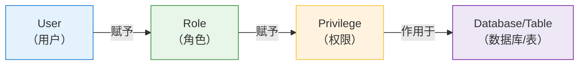

# Clickhouse权限与访问控制设计



当前测试环境:
- 主节点: `Ubuntu 24.04` 
- 从节点: `Debian 13`
- `ClickHouse server`: `25.11.2.24 (official build)`


> 适用版本：ClickHouse 23+ / 25.x  
> 适用场景：生产集群、多数据库、多团队、长期演进  
> 非目标：OLTP 事务级权限模型  

---

# 1. ClickHouse 权限设计的工程背景
## 1.1 ClickHouse 的定位决定了一切
| 数据库                 | 设计目标           |
| ---------------------- | ------------------ |
| `MySQL` / `PostgreSQL` | `OLTP（事务系统）` |
| `ClickHouse`           | `OLAP（分析系统）` |


这意味着：
* `ClickHouse` **不是为频繁 UPDATE / DELETE 设计的**  
* `ClickHouse` 的“安全边界”更多在 **结构、资源、复制层面**  

---

# 2. 集群、Keeper 与权限的真实关系

## 2.1 ON CLUSTER 的真实含义

```sql
CREATE DATABASE dbtest ON CLUSTER default_cluster;
```

**ON CLUSTER 只意味着：**

| 能力                 | 是否 |
| -------------------- | ---- |
| 当前集群节点执行 DDL | ✅   |
| 新节点加入后自动存在 | ❌   |
| 元数据持续复制       | ❌   |

- **`ON CLUSTER` 是“广播执行”，不是“持续复制”**  
- **所有已配置的节点必须在线，否则 `ON CLUSTER` 执行时会等待所有节点完成，从而导致执行失败**  

---

## 2.2 Keeper 对权限的影响

`Keeper` 负责：

* 分布式 `DDL` 协调
* `Replicated` 表元数据
* 副本状态

因此：

* 没有 `Keeper`，`ON CLUSTER` 权限 / DDL **不可用**
* 部分权限（`SYSTEM` / `DDL`）**隐含依赖 Keeper**

---

# 3. 数据库是权限隔离的最小单元

## 3.1 为什么禁止使用 `default` 数据库？

* 所有用户天然可见
* 权限边界模糊
* 容易被误用

📌 **规范要求：**

```text
default 数据库只允许运维访问
```

---

## 3.2 一个 clickhouse-server 应该有多少数据库？

> **原则：一个业务 / 团队 = 一个数据库**

这是后续权限、审计、迁移的基础。

---

# 4. 数据库创建规范

## 4.1 两种数据库模式必须明确区分

## 模式一：Atomic Database（非持续复制）

```sql
CREATE DATABASE dbtest ON CLUSTER default_cluster ENGINE = Atomic;
```

特点：

* 结构简单
* ❌ 新节点加入后需手动建库

适合：
👉 集群稳定、扩容极少

---

## 模式二：Replicated Database（推荐生产）

```sql
CREATE DATABASE dbtest ON CLUSTER default_cluster ENGINE = Replicated('/clickhouse/databases/dbtest', '{shard}', '{replica}');
-- Replicated 引擎：
-- 在 ClickHouse 中，Replicated 引擎用于在集群中的多个节点上存储相同的数据副本。
-- 这可以确保即使某些节点出现故障，数据仍然可用。每个副本会保持一致性，并能自动进行故障恢复
-- '/clickhouse/databases/<db_name>', '{shard}', '{replica}'
```

特点：

* 数据库元数据存于 Keeper
* 新节点自动可见
* 扩容成本最低(全自动)

📌 **这是“长期可演进集群”的推荐选择**

---

# 5. 表级复制是“自动复制”的真正前提

## 5.1 标准建表规范

```sql
CREATE TABLE dbtest.test_table
-- 一般由 create database 指定，指定后此处就不再指定，否则会报告错误 
-- ON CLUSTER default_cluster
(
    event_time DateTime,
    user_id UInt64,
    event_type String
)
ENGINE = ReplicatedMergeTree
PARTITION BY toYYYYMM(event_time)
ORDER BY (event_time, user_id);

-- 推荐设置此项，防止数据堆积
-- TTL event_time + INTERVAL 7 DAY TO DISK 'cold' SETTINGS storage_policy = 'hot_to_cold';
-- 根据 event_time 字段，自动将超过 7 天的数据迁移到 'cold' 存储中，并使用 hot_to_cold 存储策略。
-- 存储策略配置查看 config.d/storage.xml
```

## 关键结论：

* 是否自动复制 **与 ON CLUSTER 无关**
* 是否自动复制 **完全取决于 ReplicatedMergeTree**

---

## 5.2 关于 Replicated 路径（重要结论）

在 `ClickHouse 23+ / 25.x` 中：

```sql
ENGINE = ReplicatedMergeTree
-- 不再推荐手写 ZooKeeper / Keeper 路径，而是自动生成路径
-- 此项设定会避免不必要的冲突、便于迁移、也更加安全
```

## 5.3 扩容时「自动复制」是如何发生的？
- 当你：
    1. 新增一台 `ClickHouse` 节点
    2. 加入 `cluster.xml`
    3. 配置相同的 `Keeper`
    4. 启动 `clickhouse-server`

- 会发生：
    1. `Replicated Database`：  
        - 自动看到 `dbtest` 数据库

    2. `ReplicatedMergeTree` 表：  
        - 自动创建 `replica`  
        - 自动拉取历史数据  

必要时可手动触发：
```sql
SYSTEM SYNC REPLICA dbtest.test_table;
```
---

# 6. ClickHouse 集群架构设计与元数据管理
## 6.1 传统模式(Atomic 数据库 + 手动路径管理)
1. 数据库创建：使用 `Atomic` 引擎（不带路径参数）。
2. 表创建：必须指定路径参数。
    ```sql
    -- 数据库只是个文件夹（Atomic 默认）
    CREATE DATABASE testdb ON CLUSTER default_cluster; 

    -- 表必须明确告诉 Keeper 它的位置
    CREATE TABLE testdb.test_table (...) 
    ENGINE = ReplicatedMergeTree('/clickhouse/tables/{shard}/dbtest/test_table', '{replica}')
    ORDER BY id;
    ```
3. 优缺点
    - 元数据存储：散落在每个节点的本地磁盘。
    - 同步机制：依赖 `ON CLUSTER` 语句进行即时广播。如果节点在执行时离线，则该节点不会创建表。
    - 路径定义：必须手动在 SQL 中指定 ZooKeeper 路径，运维成本随表数量线性增长


> 此项适用于：**小规模集群、表数量不多、扩容频率极低**

## 6.2 元数据托管模式(Replicated 数据库 + 自动元数据托管)
1. 数据库创建：使用 `Replicated` 引擎, 携带 `ZK` 路径， 表创建不携带 `ZK` 路径 
    ```sql
    -- 1. 创建高可用同步库 (指定库级 ZK 根路径)
    -- Replicated('/clickhouse/databases/<db_name>', '{shard}', '{replica}');
    CREATE DATABASE dbtest ON CLUSTER default_cluster 
    ENGINE = Replicated('/clickhouse/databases/dbtest', '{shard}', '{replica}');

    -- 2. 创建表：严禁指定参数，实现全自动托管
    CREATE TABLE dbtest.order_items ON CLUSTER default_cluster
    (
        order_id UInt64,
        price Float64
    )
    ENGINE = ReplicatedMergeTree
    ORDER BY order_id;
    ```
2. 优缺点
    - 元数据存储：集中化存储在 `Keeper/ZooKeeper` 中。
    - 同步机制：新节点启动时自动拉取 `Keeper` 上的库表定义。无需关心 `ON CLUSTER` 是否送达，具有**自愈**能力。
    - 路径定义：由数据库引擎根据 `UUID` 自动分配路径，消灭了手动拼接路径导致的碰撞风险。
    - 扩容时只需配置新节点的 `macros.xml` 并启动，数秒内所有库、表自动**克隆**完成，运维实现***零介入***。

> 此项适用于：**大规模集群、表数量多、扩容频繁**

--- 


# 7. 权限模型总览（核心结构）



* 用户只绑定角色
* 角色才拥有权限
* 权限始终以数据库为边界

---

# 8. 运维角色设计（全局）

## 8.1 为什么运维角色是全局的？

* 表结构、复制、副本是全局行为
* 拆分会造成权限碎片

---

## 8.2 推荐运维角色（生产）

```sql
CREATE ROLE ops_role ON CLUSTER default_cluster;
GRANT SELECT, CREATE, ALTER, OPTIMIZE, SYSTEM, SHOW ON *.* TO ops_role;
```

不直接授予 `ALL`, 原因：`DROP` / `TRUNCATE` 属于事故级操作

## 8.3 超级管理员角色 (不推荐)
```sql
CREATE ROLE admin_role ON CLUSTER default_cluster;

GRANT ALL ON *.* TO admin_role WITH GRANT OPTION;
-- 默认default不具备 ALL 的授权，因此上诉授权可能失败，采用以下方式解决，或者通过配置文件建立一个具备all的管理用户(TODO: 未测试该项)
-- GRANT CURRENT GRANTS ON *.* TO admin_role;

-- 查看 admin_role 的权限
-- SHOW GRANTS FOR admin_role;
-- 以 ops_user 身份登录后执行
-- SELECT * FROM system.grants WHERE user_name = current_user();
-- 管理员账号下查看该角色链条
-- SELECT * FROM system.grants WHERE role_name = 'admin_role';
```

---

# 9. 业务角色设计（核心）
命名规范应该遵循 `<database>_(read|write|admin)` 的格式，例如 `dbtest_read`、`dbtest_write`、`dbtest_admin`。这样命名可以清晰地表示角色的用途和所属的数据库。   

## 9.1 标准业务库角色

```sql
-- 只读角色
CREATE ROLE dbtest_read;
GRANT SELECT ON dbtest.* TO dbtest_read;

-- 可写角色
CREATE ROLE dbtest_write;
GRANT SELECT, INSERT ON dbtest.* TO dbtest_write;
```

---
## 9.2 为什么生产程序用户不授予 UPDATE / DELETE？
-  根本原因
| 数据库             | UPDATE / DELETE |
| ------------------ | --------------- |
| `MySQL / PostgreSQL` | 原生能力        |
| `ClickHouse`         | 高成本模拟      |

`ClickHouse` 的 `DELETE` / `UPDATE`：

* 本质是数据重写  
* `高 IO` / `高 CPU ` 
* 容易引发 `merge` 堆积  

📌 **行业共识：生产程序不直接删改**

---

## 9.3 推荐替代方式

| 场景       | 推荐           |
| ---------- | -------------- |
| 数据过期   | `TTL`            |
| 大批量删除 | `DROP PARTITION` |
| 修正数据   | `重算 + INSERT`  |
| 极少纠错   | `运维 ALTER`     |

---

# 10. 测试环境权限（例外规则）

```sql
GRANT SELECT, INSERT, UPDATE, DELETE ON test_dbtest.* TO test_app_role;
-- GRANT ALL ON test_dbtest.* TO test_app_role;
```
**必须明确：仅限测试环境**

---

# 11. 用户绑定规范
```sql
-- 创建用户
-- 注意: 用户、授权、访问控制都可以通过配置文件 users.xml 进行配置，节点扩展时候，该项是不会进行同步的，需要手动同步
-- 但可以通过 开启权限信息的 ZooKeeper 存储（Replicated Access），实现权限的同步（TODO: 此项未测试）
CREATE USER app_user ON CLUSTER default_cluster IDENTIFIED BY 'StrongPassword';

-- 授权角色给用户, 多个角色逗号隔开 
GRANT dbtest_write TO app_user;

-- 角色授权还有一种为角色继承机制,比如下面的是 ops_role 继承 admin_role 的权限，继承的机制是合并(TODO: 未测试此项)
-- GRANT admin_role TO ops_role ON CLUSTER default_cluster;
```

## 11.1 禁止使用 default 用户
```sql
ALTER USER default SETTINGS readonly = 1;
```

## 11.2 限制角色/用户的登陆来源
```sql
-- TODO: 此项待完善
```

# 12. 用户权限同步
## 12.1 传统模式
- 权限信息存在本地 `.sql` 文件中, 一般位于 `/var/lib/clickhouse/access` 中

## 12.2 同步模式
*当你在集群任何一个节点执行 `CREATE USER ... ON CLUSTER` 时，该操作会被记录到 `Keeper`。其他节点监听该路径，一旦有变动，会自动将权限信息拉取到本地内存生效。*

1. 权限信息以**元数据形式**存放在 `Keeper/ZooKeeper` 的指定路径下。  
2. 核心配置 
    ```xml
    <!-- /etc/clickhouse-server/config.d/replicated_access.xml -->
    <clickhouse>
        <user_directories replace="replace">
            <!-- 主存储：ZooKeeper -->
            <replicated>
                <zookeeper_path>/clickhouse/access/</zookeeper_path>
            </replicated>
            <!-- 本地缓存 & 容灾 -->
            <local_directory>
                <path>/data/_clickhouse/access/</path>
            </local_directory>
            
            <users_xml>
                <path>users.xml</path>
            </users_xml>
        </user_directories>
    </clickhouse>
    ```
3. 验证
    ```sql
    -- 主节点创建后，新加入的节点即可查看
    SHOW USERS;
    SHOW ROLES;

    -- 查看当前节点正在使用的用户目录
    SELECT name,type,params FROM system.user_directories
    ```

> 若为发现权限同步，可能是角色创建在同步模式之前 

---

# 13. Settings Profile（权限设计的重要补充）

## 13.1 为什么 settings 是权限的一部分？

在 `ClickHouse` 中：

> **资源滥用比权限越权更常见**

---

## 13.2 程序用户推荐限制

```sql
-- 创建一个资源限制模板
CREATE SETTINGS PROFILE high_priority ON CLUSTER default_cluster 
SETTINGS 
    -- 此项计算 (系统总内存 / 最大查询并发数 ) x 每个查询的内存比例因子(通常设定为 0.05 至 0.2（即每个查询使用系统总内存的 5% 至 20%）)
    max_memory_usage = 8G,      
    -- 通常建议与cpu核心数保持一致 
    max_threads = 8,            
    max_execution_time = 30,
    read_overflow_mode = 'throw';

-- 绑定给用户
ALTER USER readonly_user ON CLUSTER default_cluster SETTINGS PROFILE high_priority;

-- 例子分析
-- -- 假设系统总内存为 64GB，并且预计最多同时执行 20 个查询，每个查询使用 4 个线程：
-- 每个查询的内存使用量：
-- -- max_memory_usage_per_query = (64GB / 20) * 0.1 = 0.32GB
-- 每个查询使用 4 个线程时，内存使用量为：
-- -- max_memory_usage_per_query_with_threads = 0.32GB * 4 = 1.28GB
-- 这样，如果你同时执行 20 个查询，每个查询使用最多 1.28GB 内存，那么总内存使用量为：
-- TotalMemoryUsage = 1.28GB * 20 = 25.6GB

-- 如果你的服务器总内存为 64GB，那么该配置是合理的，因为最大查询总内存使用量仅为 25.6GB，远低于系统的总内存。

```

---

# 14. 高风险操作清单（必须人工控制）

| 操作                    | 原因         |
| ----------------------- | ------------ |
| `DROP TABLE`            | 不可逆       |
| `TRUNCATE`              | 数据瞬间丢失 |
| `ALTER UPDATE / DELETE` | 高成本       |
| `SYSTEM STOP MERGES`    | 影响全局     |

---

# 15. 最小可复用初始化模板（汇总）

```sql
-- 数据库
CREATE DATABASE dbtest ON CLUSTER default_cluster ENGINE = Replicated('/clickhouse/databases/dbtest', '{shard}', '{replica}');

-- 表
-- 若数据库创建使用 ON CLUSTER，表创建不再使用 ON CLUSTER
-- 推荐增加 TTL
CREATE TABLE dbtest.test_table
-- ON CLUSTER default_cluster 
(...)
ENGINE = ReplicatedMergeTree ORDER BY (...);

-- 角色
CREATE ROLE dbtest_read;
CREATE ROLE dbtest_write;
CREATE ROLE ops_role;

GRANT SELECT ON dbtest.* TO dbtest_read;
GRANT SELECT, INSERT ON dbtest.* TO dbtest_write;
GRANT SELECT, CREATE, ALTER, SYSTEM, OPTIMIZE ON *.* TO ops_role;
```

---

> 作者: [0x5c0f](https://blog.0x5c0f.cc)  
> URL: https://blog.0x5c0f.cc/posts/linux/clickhouse%E6%9D%83%E9%99%90%E4%B8%8E%E8%AE%BF%E9%97%AE%E6%8E%A7%E5%88%B6%E8%AE%BE%E8%AE%A1/  

