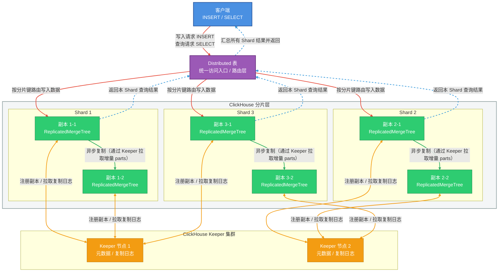
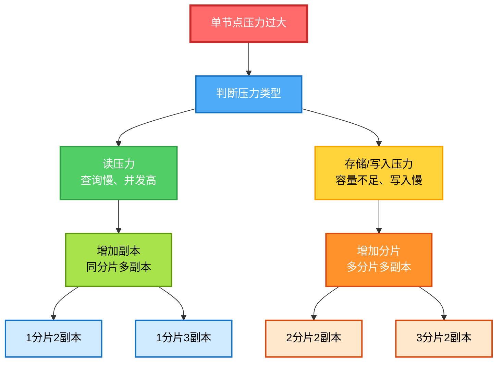

# Clickhouse集群实践指南



当前测试环境:
- `Ubuntu 24.04` 
- `ClickHouse server version 25.11.2.24 (official build)`


## 1. 写在前面：这篇文章适合谁？

* ✔ 第一次接触 ClickHouse 集群
* ✔ 想从一开始就用“正确姿势”
* ✔ 不想以后因为早期决策返工
* ✔ 需要一份 **可长期复用的模板**

**不适合**：

* 只想临时跑个 demo
* 不关心扩容 / 高可用 / 运维

---

## 2. 官方安装指南
> [https://clickhouse.com/docs/zh/install](https://clickhouse.com/docs/zh/install)

## 3. ClickHouse 集群的整体认知

在 `ClickHouse` 中，`“集群”`不是一个开关，而是**一整套能力的组合**：




**记住一句话**：
> `ClickHouse` 的高可用 = `数据可复制` + `元数据不丢` + `访问不中断`

---

## 4. 为什么“单节点也要用集群模式初始化”

### 4.1. 常见误区
> “现在只有一台机器，用单机模式更简单吧？”

***这是 ClickHouse 中最容易留下技术债的决定。***

---

### 4.2. 正确做法（推荐）

即使只有 **1 台机器**，也要：

* 配置 [`cluster.xml`](#5-集群配置clusterxml)
* 配置 [`keeper.xml`](#62-keeperxml最小可用单节点)
* 配置 [`macros.xml`](#82-高可用版本推荐生产)
* 配置 [`replicated_access.xml`](/posts/linux/clickhouse权限与访问控制设计#12-用户权限同步)
* 所有 DDL 使用 `ON CLUSTER`
* 所有的表都使用 `ReplicatedMergeTree`

原因：

| 好处           | 解释                     |
| -------------- | ------------------------ |
| 表结构不返工   | 以后加节点不用重建       |
| 用法统一       | 单机 / 集群 SQL 一样     |
| 符合 25.x 设计 | ON CLUSTER 强依赖 Keeper |

---

## 5. 集群配置：cluster.xml

### 5.1. 文件位置（约定）

```bash
/etc/clickhouse-server/config.d/cluster.xml
```

### 5.2. 示例（单节点起步）
- 关键说明
    * **cluster 名字非常重要** 后续所有 `ON CLUSTER xxx` 都依赖它
    * shard ≠ replica
        * shard：数据水平切分
        * replica：同一数据的副本

    ```xml
    <clickhouse>
        <!-- 强制指定 ClickHouse 使用IP进行注册 -->
        <interserver_http_host>172.16.80.31</interserver_http_host>
        <remote_servers>
            <!-- 集群名称，后续 SQL 会用到 -->
            <default_cluster>
                <!-- shard：数据分片
                    shard 数量 = 数据水平切分的数量
                    一个 shard 可以包含多个 replica（副本节点） -->
                <shard>
                    <!-- 决定数据是如何在副本之间"流动", 配合 ReplicatedMergeTree 的时候必须设置为 true -->
                    <internal_replication>true</internal_replication>
                    <!-- replica：副本 -->
                    <replica>
                        <host>172.16.80.31</host>
                        <port>9000</port>
                    </replica>
                    <!-- <replica>
                        <host>172.31.10.12</host>
                        <port>9000</port>
                    </replica> -->
                </shard>
            </default_cluster>
        </remote_servers>
    </clickhouse>
    ```
---

## 6. Keeper：为什么必须有 ？ & 怎么配 ？

### 6.1. Keeper 是干什么的？

`Keeper` 负责：

* 分布式 DDL（`ON CLUSTER`）
* 副本元数据
* 表锁
* 副本状态协调

**没有 Keeper，集群会“看起来存在，但不能用”**

---

### 6.2. keeper.xml（最小可用，单节点）

- `/etc/clickhouse-server/config.d/keeper.xml`

    ```xml
    <clickhouse>
        <!-- Keeper 的配置，只要保持各个节点在 raft_configuration 和 zookeeper 中即可，无关顺序节点类型 -->
        <!-- Keeper 服务本身 -->
        <keeper_server>
            <!-- Keeper 对外端口 -->
            <tcp_port>9181</tcp_port>
            <!-- 每台机器唯一，不能重复， 需要与 raft_configuration - server - id 保持一致 -->
            <server_id>1</server_id>
            <coordination_settings>
                <operation_timeout_ms>10000</operation_timeout_ms>
                <session_timeout_ms>30000</session_timeout_ms>
            </coordination_settings>
            
            <!-- Raft 成员（单节点也要写） -->
            <raft_configuration>
                <!-- 多少个节点(成员), 多少个 server , 其中id与对应的 server_id 保持一致 -->
                <server>
                    <id>1</id>
                    <hostname>172.16.80.31</hostname>
                    <!-- 9234 是 Keeper 节点之间 Raft 通信端口 -->
                    <port>9234</port>
                </server>
                <!-- <server>
                    <id>2</id>
                    <hostname>172.31.10.12</hostname>
                    <port>9234</port>
                </server> -->
            </raft_configuration>
        </keeper_server>
        <!-- ClickHouse Server 通过这里访问 Keeper -->
        <zookeeper>
            <!-- 同样多少个节点,多少个node -->
            <node>
                <host>172.16.80.31</host>
                <!-- 9181 是 ClickHouse Server 连接 Keeper 的端口 -->
                <port>9181</port>
            </node>
            <!-- <node>
                <host>172.31.10.12</host>
                <port>9181</port>
            </node> -->
        </zookeeper>
    </clickhouse>
    ```

- **易错点**

* `server_id` **每台必须不同**
* Keeper 的目录 **不要和数据目录混在一起**
* 即使单节点，也必须写 `raft_configuration`

---

## 7. 多磁盘 / 冷热分层（初始化就该做）

### 7.1. 为什么要一开始就配置？

* 冷热分层是 **表级能力**
* 表一旦建好，后面再补策略会很痛苦
* Disk 在 ClickHouse 中只是**目录抽象**

👉 所以：**可以先“假装有多块盘”**

---

### 7.2. storage.xml

- `/etc/clickhouse-server/config.d/storage.xml`
    ```xml
    <clickhouse>
        <!-- ClickHouse 数据根目录 -->
        <!-- 所有表、元数据都在这里 -->
        <path>/data/_clickhouse/</path>

        <!-- 
            sudo mkdir -p /data/_clickhouse/coordination/{log,snapshots}
            sudo chown -R clickhouse:clickhouse /data/_clickhouse
        -->

        <!-- 访问控制与权限存储路径 -->
        <!-- 此项设定实际上已过时(低版本兼容可用)，交由 user_directories.local_directory 进行控制 -->
        <!-- <access_control_path>/data/_clickhouse/access/</access_control_path> -->

        <!-- 用户文件沙盒路径 -->
        <user_files_path>/data/_clickhouse/user_files/</user_files_path>

        <!-- 格式结构定义路径 -->
        <format_schema_path>/data/_clickhouse/format_schemas/</format_schema_path>

        <!-- Keeper 服务数据存储路径 -->
        <keeper_server>
            <!-- 存放 Keeper 的 Raft 事务日志 -->
            <log_storage_path>/data/_clickhouse/coordination/log</log_storage_path>
            <!-- 存放 Keeper 的 状态快照 -->
            <snapshot_storage_path>/data/_clickhouse/coordination/snapshots</snapshot_storage_path>
        </keeper_server>

        <!-- 多磁盘配置 -->
        <storage_configuration>
            <!-- 定义磁盘（逻辑） -->
            <disks>
                <!-- 热数据盘（模拟 SSD） -->
                <hot>
                    <type>local</type>
                    <path>/data/_clickhouse/hot/</path>
                </hot>

                <!-- 冷数据盘（模拟 HDD） -->
                <cold>
                    <type>local</type>
                    <path>/data/_clickhouse/cold/</path>
                </cold>

            </disks>

            <!-- 存储策略 -->
            <policies>
                <!-- 冷热分层策略名称 -->
                <hot_to_cold>
                    <volumes>
                        <!-- 新数据优先写这里 -->
                        <hot_volume>
                            <disk>hot</disk>
                        </hot_volume>
                        <!-- 冷数据移动到这里 -->
                        <cold_volume>
                            <disk>cold</disk>
                        </cold_volume>
                    </volumes>
                    <!-- hot 使用率 > 80% 时允许 move -->
                    <move_factor>0.2</move_factor>
                </hot_to_cold>
            </policies>
        </storage_configuration>
    </clickhouse>

    ```

- **注意**

* 所有节点的 `disk` / `policy` 名称必须一致
* 后续换真实 `SSD` / `HDD` 只改 `path`

## 8. 标准建表模板（冷热分层 + 可扩展）
### 8.1. 单副本（入门 / 非 HA）
```sql
CREATE TABLE dbtest.test_table
-- ON CLUSTER 在创建数据库的时候如果已指定，这儿就不需要了，否则会报告错误
-- ON CLUSTER 的作用是"广播执行", 不是"持续复制"
ON CLUSTER default_cluster
(
    event_time DateTime,
    user_id UInt64,
    event_type String,
    payload String
)
PARTITION BY toYYYYMM(event_time)
ORDER BY (event_time, user_id)
TTL event_time + INTERVAL 7 DAY TO DISK 'cold'
SETTINGS
    storage_policy = 'hot_to_cold';
```
---

### 8.2. 高可用版本（推荐，生产）
更多内容查看[**<<集群架构设计与元数据管理>>**](/posts/linux/clickhouse权限与访问控制设计/#6-clickhouse-集群架构设计与元数据管理)
<!-- 元数据托管模式; 传统手动模式 -->

```xml
<!-- /etc/clickhouse-server/config.d: macros.xml -->
<clickhouse>
    <macros>
        <!-- 分片标识，用于分布式查询，同一分片需要保持一致 -->
        <shard>01</shard>
        <!-- 副本标识符（在同一分片的副本中必须唯一） -->
        <replica>01_01</replica>
    </macros>
</clickhouse>
```

```sql
CREATE TABLE dbtest.test_table
-- ON CLUSTER 在创建数据库的时候如果已指定，这儿就不需要了，否则会报告错误
-- ON CLUSTER 的作用是"广播执行", 不是"持续复制"
ON CLUSTER default_cluster
(
    event_time DateTime,
    user_id UInt64,
    event_type String,
    payload String
)
-- ReplicatedMergeTree 定义路径在非多租户的情况下，下列模板应是一个最优解
-- '/clickhouse/tables/{shard}/<db_name>/<table_name>','{replica}'
-- 为什么要定义路径而不默认由系统自行判定呢?
-- 注: 当前为手动模式情况下，ZK 路径指定只能在建表或者建库当中的一个指定，当前介绍的是在建表时指定的情况(传统手动模式)
-- 因为系统默认行为通常会使用类似 /clickhouse/tables/{uuid}/{shard}, 其中uuid
-- 是数据库自动生成的唯一 ID, 这会导致新节点加入时非常很难"自动对接"。 因为新节点在手动创建表时，系统也会生成一个新的随机 uuid。
-- 这意味着新节点生成的自动路径会和旧节点不一致。路径不一致，数据就永远无法自动同步,除非你自己一个个去查询主节点然后手动固定路径，非常痛苦。
ENGINE = ReplicatedMergeTree('/clickhouse/tables/{shard}/dbtest/test_table', '{replica}')
PARTITION BY toYYYYMM(event_time)
ORDER BY (event_time, user_id)
TTL event_time + INTERVAL 7 DAY TO DISK 'cold'
SETTINGS
    storage_policy = 'hot_to_cold';
```

- **为什么一定要 ReplicatedMergeTree？**

* 扩容后自动补数据
* 节点挂掉不丢数据
* 支持滚动升级


**注: 根据已搜集到的信息说明，单节点和高可用模式尽量不要混用,否则容易后期的数据同步异常(未测试)**

---

## 9. Distributed 表（统一读写入口）

```sql
CREATE TABLE dbtest.test_table_all
ON CLUSTER default_cluster
AS dbtest.test_table
ENGINE = Distributed(
    --  指定该表要往哪个集群里分发数据
    default_cluster,
    -- 指定本地表所在的数据库名
    dbtest,
    -- 指定本地表的名称（数据真正存储的地方）
    test_table,
    -- 分流策略,用于决定数据流向哪个分片
    -- 随机分发: rand()
    -- 固定值分发: 1
    -- 字段直接分发: user_id
    -- 业务逻辑分发: cityHash64(user_id,...)
    -- 权重分发： 在cluster 中去定义权重
    cityHash64(user_id)
);
```

**使用原则**：

* 写 → `test_table_all`
* 查 → `test_table_all`
* 不直接访问本地表

---

## 10. 表命名规范
### 10.1. 行业级数仓表命名总规范（核心）

1. 统一命名模型（强烈推荐）
    ```
    <数据层>_<来源系统>_<业务域>_<业务实体>_<加工类型>_<时间粒度>
    ```

> 表名本身就是一份“元数据”

2. 字段含义说明
| 组成     | 含义             | 示例                        |
| -------- | ---------------- | --------------------------- |
| 数据层   | 数仓分层         | ods / dwd / dws / dim / ads |
| 来源系统 | 数据来源系统     | crm / erp / app / pay / log |
| 业务域   | 一级业务域       | trade / user / content      |
| 业务实体 | 核心业务对象     | order / user / sku          |
| 加工类型 | 明细/汇总/拉链等 | detail / snapshot / acc     |
| 时间粒度 | 数据粒度         | day / hour / month / full   |

---

### 10.2. ClickHouse 表类型命名规范
1.  `ReplicatedMergeTree（本地表）`
- 命名规则
    ```
    <数据层>_<来源系统>_<业务域>_<业务实体>_<加工类型>_<时间粒度>_local
    ```

- 示例 
| 场景           | 表名                                      |
| -------------- | ----------------------------------------- |
| 订单明细事实表 | `dwd_erp_trade_order_detail_day_local`    |
| 用户行为日志   | `ods_app_log_user_action_detail_local`    |
| 商品维度表     | `dim_erp_product_sku_snapshot_full_local` |
| 用户日汇总     | `dws_app_user_login_acc_day_local`        |

2. `Distributed（分布式表）`
- 命名规则
    ```
    <数据层>_<来源系统>_<业务域>_<业务实体>_<加工类型>_<时间粒度>_(all|dist)
    ```
- 示例
| Distributed 表                          | 对应 Local                                |
| --------------------------------------- | ----------------------------------------- |
| `dwd_erp_trade_order_detail_day_all`    | `dwd_erp_trade_order_detail_day_local`    |
| `ods_app_log_user_action_detail_all`    | `ods_app_log_user_action_detail_local`    |
| `dim_erp_product_sku_snapshot_full_all` | `dim_erp_product_sku_snapshot_full_local` |

> `_all`  代表全量数据(跨shard)  
> `_dist` 分布式路由

- 如何抉择 `_all`/`_dist` ?
    - `数仓` / `业务` / `BI` / `数据服务` 应该只认`_all`。
    - `工程` / `运维` / `底层路由` 可以存在 `_dist`, 但不应用于业务使用。


### 10.3. 数据层级命名（行业标准）

| 层级  | 含义                     |
| ----- | ------------------------ |
| `ods` | 贴源数据（准实时/离线）  |
| `dwd` | 明细事实（业务语义清洗） |
| `dws` | 轻度汇总（公共指标）     |
| `dim` | 维度表                   |
| `ads` | 应用层 / 报表层          |

- **ClickHouse 通常以 dwd / dws / ads 为主**


### 10.4. 来源系统命名规范
- 命名原则
    * 使用 **稳定系统标识**
    * 不使用部署名、环境名
    * 多源不混用

- 示例
| 系统     | 命名    |
| -------- | ------- |
| App 埋点 | `app`   |
| ERP      | `erp`   |
| CRM      | `crm`   |
| 支付     | `pay`   |
| 日志平台 | `log`   |
| 第三方   | `third` |

### 10.5 业务域 & 业务实体规范
- 业务域（Domain）
    ```
    trade / user / content / finance / risk
    ```

- 业务实体（Entity）
    ```
    order / refund / user / sku / coupon
    ```

- **实体名必须是“名词”**

### 10.5. 加工类型（行业强约定）
| 类型       | 含义     | 说明           |
| ---------- | -------- | -------------- |
| `detail`   | 明细事实 | 一行一业务事件 |
| `snapshot` | 快照     | 当前状态       |
| `acc`      | 累计     | 期间累计       |
| `delta`    | 增量     | 变更数据       |
| `zipper`   | 拉链表   | 状态变更历史   |

### 10.7. 时间粒度命名

| 粒度 | 示例                |
| -- | ----------------- |
| 明细 | `full` / `detail` |
| 小时 | `hour`            |
| 天  | `day`             |
| 月  | `month`           |


### 10.8. ZooKeeper 路径命名规范（ClickHouse 特有）
```
/clickhouse/tables/{shard}/<db_name>/<table_name>
```

- 与 **Distributed 表同名**  
- 不带 `_local`

### 10.9. 完整示例
- `ReplicatedMergeTree（本地表）`
    ```sql
    CREATE TABLE dbtest.dwd_erp_trade_order_detail_day_local
    (
        order_id UInt64,
        user_id UInt64,
        order_amount Decimal(18,2),
        order_time DateTime
    )
    ENGINE = ReplicatedMergeTree(
        '/clickhouse/tables/{shard}/dbtest/dwd_erp_trade_order_detail_day',
        '{replica}'
    )
    PARTITION BY toYYYYMM(order_time)
    ORDER BY (order_id);
    ```

- `Distributed 表`
    ```sql
    CREATE TABLE dbtest.dwd_erp_trade_order_detail_day_dist
    AS dwd_erp_trade_order_detail_day_local
    ENGINE = Distributed(
        ck_cluster,
        default,
        dwd_erp_trade_order_detail_day_local,
        cityHash64(order_id)
    );
    ```

### 10.10. 命名反例（行业强禁止）
- [x] `order_detail`（缺少层级、来源）  
- [x] `ods_trade_order_v2`（版本号禁止）  
- [x] `user_order_local`（语义不完整）  
- [x] `trade_order_dist`（表类型不进表名）  
- [x] `prod_dwd_order`（环境不进表名）  


### 10.11. 推荐最终对照表

| 类型     | 表名                                                                     |
| -------- | ------------------------------------------------------------------------ |
| 本地表   | `dwd_erp_trade_order_detail_day_local`                                   |
| 分布式表 | `dwd_erp_trade_order_detail_day`                                         |
| ZK Path  | `/clickhouse/tables/{shard}/<db_name>/<table_name>` |


## 11. 备份与恢复(未测试)
### 11.1. 推荐工具：clickhouse-backup
**部署位置**：
👉 每个 `ClickHouse` 节点（或运维机）

---

### 11.2. 创建备份
包含：
* 表结构
* 数据（支持增量）

```bash
clickhouse-backup create daily_2025_12_18
```

---

### 11.3. 恢复示例（单表）
```bash
clickhouse-backup restore --table dbtest.test_table daily_2025_12_18
```

### 11.4. 恢复整个数据库
```bash
clickhouse-backup restore daily_2025_12_18
```

### 11.5. 其他
-  备份 `/var/lib/clickhouse` 目录(最后防线,但可能不靠谱)

---

## 12. 升级和迁移(未测试)
- 要求：
* 副本 ≥ 2 
* Keeper 存活 

### 12.1. 正确姿势：滚动升级
```bash
node1 升级 → OK
node2 升级 → OK
```

### 12.2. 升级前必做：
```bash
-- 强制同步
SYSTEM SYNC REPLICA;
```

### 12.3. 迁移（换机器 / 扩容）
正确方式:
* 新节点上线
* 加入 `cluster.xml`
* `Replicated` 表自动同步
* 移除旧节点

## 13. 高可用(未测试)
### 13.1. 自动重试 9000 端口
### 13.2. HAProxy
- 支持 `TCP`
- 健康检查好
- 性能稳定

```bash
frontend clickhouse
    bind *:9000
    default_backend ch_nodes

backend ch_nodes
    balance roundrobin
    server n1 172.31.10.11:9000 check
    server n2 172.31.10.110:9000 check
```
### 13.3. 不推荐 Nginx（除非 HTTP）
`Nginx`：
- 更适合 `8123`
- 不适合高并发 `TCP` 查询

## 14. 扩容与自动复制是如何发生的？

### 14.1. 如何新增节点？
***所有需要调整的配置项，在配置文件模板中均有定义，可以自行参考阅读***  
1. 主节点和新增节点的 [`cluster.xml`](#5-集群配置clusterxml)、[`keeper.xml`](#62-keeperxml最小可用单节点) 、[`macros.xml`](#82-高可用版本推荐生产)、[`storage.xml`](#72-storagexml) 配置文件需要保持高度一致，以下是需要修改的地方
    - `cluster.xml`
        - `interserver_http_host` 项, 值对应当前节点的 `IP`
        - `shard` 项, 在下面添加一个 `replica` 副本节点(*注: 若是分片就添加一个`shard`*)

    - `keeper.xml`, `keeper.xml` 配置文件对于无论对于哪一个节点来说，除了 `server_id` 不一样外，其他应完全一样
        - `server_id` 项, 各个节点保持唯一
        - `raft_configuration` 项, 在下面添加一个`server`节点, 值为对应节点的 `IP` 和 `server_id`
        - `zookeeper` 项, 在下面添加一个 `node` 节点
    - `macros.xml`
        - `replica` 项，保持设置节点的唯一性
    - `storage.xml`
        - 此配置每个节点完全一致(*仅测试时候，实际应用中可能由于服务器环境不同，需要根据实际情况修改*)
        
2. 复制主节点自定义配置文件到新节点的 `/etc/clickhouse-server/config.d`, 修改上述内容
3. 配置同步后，重启主节点， 然后重启新节点(*这个重启顺序应该没什么关系，实际测试时候是先重启主节点、在重新的新节点*)
4. 登陆到新节点，等待同步完成，如果没有进行同步那么就需要手动创建与主节点相同的数据库、相同的表结构(**注: 建表和建库的时候，需要保持与主节点的`ZK`路径完全一致，否则难以自动同步数据,这也是为什么在见表的时候要求手动指定`ZK`路径的原因**)

### 14.2. 如何自动复制？
- 当你有一个 `ReplicatedMergeTree` 表时：
    1. 每个副本在 `ZooKeeper` 注册自己
        - `/clickhouse/tables/{shard}/dbtest/test_table`
    2. 写入数据
        - 客户端写到任意副本
        - 副本会生成 `mutation` / `insert log` 放入 `ZooKeeper` 队列
    3. 其他副本监听 `ZooKeeper`
        - 自动检测到新的 insert
        - 拉取对应数据块（parts）并写入本地存储
    4. Merge 操作
        - 每个副本独立进行 Merge
        - 保持本地数据块高效存储
        
> 核心点：所有副本最终一致，但可以临时存在延迟（异步复制）

### 14.3. 节点扩容时发生什么？
- 新 shard / 新副本加入
    1. 新副本在 ZooKeeper 注册
    2. 系统会识别**它缺少哪些数据块（parts）**
    3. 旧副本会将已有数据块复制到新副本
    4. 新副本完成数据同步后，自动参与 Merge 和查询

> **注意**：这个过程是**增量拉取**，不会重复写入全量数据。

### 14.4. 新 shard 加入（分片扩容）
- 分片扩容相对复杂
- `ClickHouse` 原生不支持自动重分片
- 操作步骤：
    - 创建新 `shard` 的 `local` 表
    - 根据分片 `key` 手动迁移部分数据（或者使用 `INSERT SELECT`）
    - 更新 `Distributed` 表的 `shard` 配置
- 所以 shard 扩容通常是 人工触发的迁移 + 配置更新
- 副本扩容则是 自动的

> 总结：副本复制自动，分片迁移手动

---

## 15. 扩容节点时候如何选择是分片还是副本?
### 15.1.  场景 1：读压力过大（查询多、查询慢）
- 症状：
    - 大量并发查询请求
    - CPU 使用率高
    - 查询排队等待

- 解决方案：增加副本（Replica）
    ```xml
    <!-- 1分片3副本 -->
    <shard>
        <internal_replication>true</internal_replication>
        <replica><host>node1</host></replica>
        <replica><host>node2</host></replica>
        <replica><host>node3</host></replica>  <!-- 新增副本 -->
    </shard>
    ```

- 效果：
    - [x] 读请求可以分散到多个副本
    - [x] 每个副本都有完整数据，可独立处理查询
    - [x] 提高查询吞吐量
    - [ ] 不增加存储容量（每个副本存相同数据）

### 15.2. 场景 2：存储容量不足（数据量太大）
- 症状：
    - 磁盘空间不足
    - 单表数据量达到 TB 级
    - 单节点存储瓶颈

- 解决方案：增加分片（Shard）
    ```xml
    <!-- 2分片，每分片2副本 = 4节点 -->
    <shard>
        <internal_replication>true</internal_replication>
        <replica><host>node1</host></replica>
        <replica><host>node2</host></replica>
    </shard>
    <shard>
        <internal_replication>true</internal_replication>
        <replica><host>node3</host></replica>
        <replica><host>node4</host></replica>
    </shard>
    ```
- 效果：
    - [x] 数据分散存储，每个分片存一部分
    - [x] 存储容量翻倍（2分片 = 2倍容量）
    - [x] 写入压力分散
    - [x] 并行查询性能提升（多分片并行处理）

### 15.3. 场景 3：写入压力过大（插入速度慢）
- 症状：
    - 大量数据写入
    - 写入队列积压
    - Merge 操作频繁

- 解决方案：增加分片（Shard）
    - 原因：
        - 副本之间需要数据同步，写入不会更快
        - 分片可以并行写入，每个分片独立处理

### 15.4. 场景 4：既有读压力又有存储压力
- 解决方案：增加分片 + 每个分片有多个副本
    ```xml
    <!-- 2分片，每分片3副本 = 6节点 -->
    <shard>
        <replica><host>node1</host></replica>
        <replica><host>node2</host></replica>
        <replica><host>node3</host></replica>
    </shard>
    <shard>
        <replica><host>node4</host></replica>
        <replica><host>node5</host></replica>
        <replica><host>node6</host></replica>
    </shard>
    ```

### 15.5. 决策流程图

### 15.6. 实际扩展示例

#### 15.6.1. 当前状态：1节点
```
分片1
└─ 副本1 (node1) - 100% 数据，100% 压力
```

#### 15.6.2. 扩展方案 A：增加副本（应对读压力）
```
分片1
├─ 副本1 (node1) - 100% 数据，50% 读压力
└─ 副本2 (node2) - 100% 数据，50% 读压力

存储: 无增加 (2 × 100% = 200% 冗余)
读能力: 翻倍
写能力: 不变（需同步到所有副本）
```

#### 15.6.3. 扩展方案 B：增加分片（应对存储/写入压力）
```
分片1                    分片2
├─ 副本1 (node1) - 50%   ├─ 副本1 (node3) - 50%
└─ 副本2 (node2) - 50%   └─ 副本2 (node4) - 50%

存储: 翻倍 (每分片存一半)
读能力: 大幅提升（并行查询）
写能力: 翻倍（并行写入）
```

## 16. 一些常用的sql
```sql
-- 查看集群状态
SELECT * FROM system.clusters;

-- 查看 Keeper 中的 ZK 路径数据
SELECT * FROM system.zookeeper;

-- 查看副本状态
SELECT * FROM system.replicas;

-- 查看同步队列状态
SELECT * FROM system.replication_queue;

-- 验证集群是否生效(在任意一台执行)
SELECT * FROM system.clusters WHERE cluster = 'default_cluster';

-- 集群拓扑
SELECT
    cluster,
    shard_num,
    replica_num,
    host_name,
    host_address,
    port
FROM system.clusters
ORDER BY shard_num, replica_num;

--当前节点身份（宏是否生效）
SELECT getMacro('shard')  AS shard, getMacro('replica') AS replica;

--副本整体状态
--健康参考: 
--is_readonly = 0
--queue_size ≈ 0
--inserts_in_queue ≈ 0
SELECT database, table,is_leader,is_readonly,future_parts,parts_to_check,queue_size,inserts_in_queue FROM system.replicas;

--复制延迟 / 堆积详情
--判断是否存在副本 lag
--升级 / 扩容前必须检查

SELECT database,table,absolute_delay,log_max_index,log_pointer FROM system.replicas;

-- -- 强制修复常用命令
--使用建议: 
--1. 先 SYNC
--2. 再 RESTART
--3. 不要随便 DROP REPLICA

-- SYSTEM SYNC REPLICA db.table;
-- SYSTEM RESTART REPLICA db.table;


--磁盘状态
--用途: 
-- - 验证 hot / cold 是否加载
-- - 排查磁盘空间问题

SELECT name, path, free_space, total_space FROM system.disks;

-- 存储策略
SELECT * FROM system.storage_policies;

-- 表实际使用的磁盘
-- - 用途: 
-- - 验证 TTL 是否真的 move 到 cold
-- - 冷热分层是否生效
-- -- disk_name: 如果配置了多盘存储，这里会显示具体的物理盘别名（如 default, hdd, ssd）
-- -- count() AS parts: 正常情况下，一个表的 Part 数量不应过多（建议单表保持在几百个以内）。如果这个值过大，说明写入频率过高或合并（Merge）太慢。
-- readable_bytes: 反映了数据在磁盘上的实际物理占用（经过压缩后的）。
SELECT 
    database, 
    table, 
    disk_name, 
    count() AS parts, 
    formatReadableSize(sum(bytes_on_disk)) AS readable_bytes
FROM system.parts 
WHERE active -- 只统计活跃的分区，排除正在合并或过期的
GROUP BY database, table, disk_name 
ORDER BY sum(bytes_on_disk) DESC;

-- -- 监控合并队列 查看后台合并任务是否卡住
-- SELECT * FROM system.merges;


--当前正在执行的查询
SELECT query_id,user,elapsed,memory_usage,query FROM system.processes;


-- 最近慢查询
SELECT
    query_duration_ms,
    read_rows,
    result_rows,
    query
FROM system.query_log
ORDER BY query_duration_ms DESC
LIMIT 10;

--数据库级容量
SELECT
    database,
    sum(bytes_on_disk) AS size
FROM system.parts
WHERE active
GROUP BY database
ORDER BY size DESC;


-- 1. 检查集群配置是否正确(新节点)
SELECT 
   cluster,
   shard_num,
   replica_num,
   host_name,
   host_address,
   port
FROM system.clusters 
WHERE cluster = 'default_cluster'
ORDER BY shard_num, replica_num;
-- 期望结果：
-- default_cluster | 1 | 1 | 172.16.80.31 | ...
-- default_cluster | 1 | 2 | 172.31.10.12 | ...
-- 注意：shard_num 必须都是 1（同一个分片） 


-- 查看 SQL 执行错误时候的具体报错
SELECT 
    event_time, 
    query, 
    exception_code, 
    exception,  -- 具体的错误简述
    stack_trace -- 详细的错误堆栈
FROM system.query_log 
WHERE type != 'QueryFinish' -- 过滤掉成功的查询
AND type != 'QueryStart'
AND event_time > now() - INTERVAL 1 HOUR -- 查看最近一小时
ORDER BY event_time DESC 
LIMIT 10;

```

---

> 作者: [0x5c0f](https://blog.0x5c0f.cc)  
> URL: https://blog.0x5c0f.cc/posts/linux/clickhouse%E9%9B%86%E7%BE%A4%E5%AE%9E%E8%B7%B5%E6%8C%87%E5%8D%97/  

