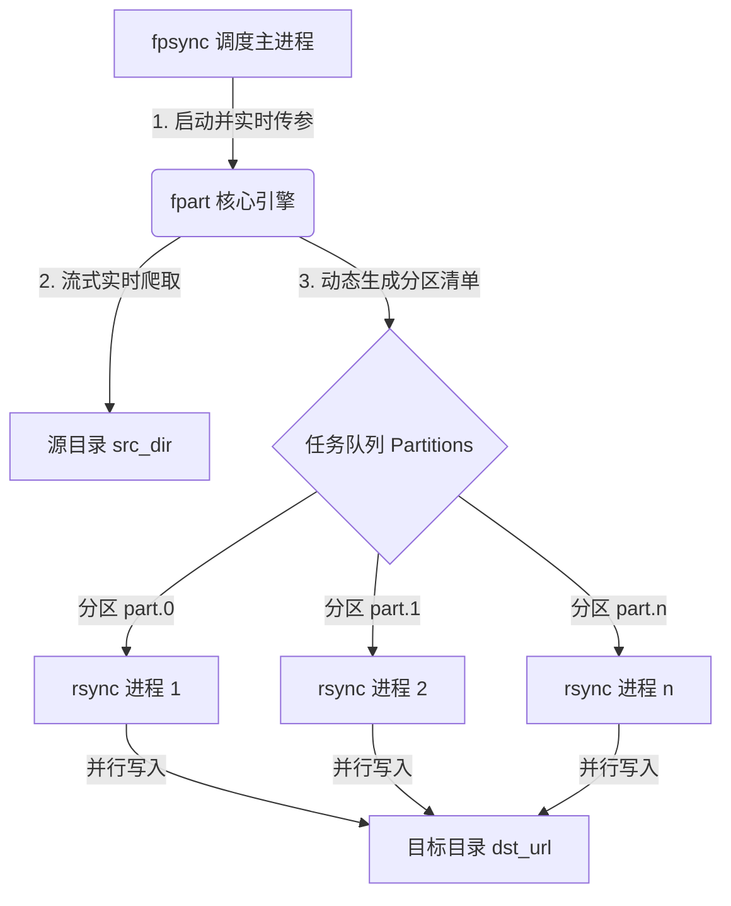
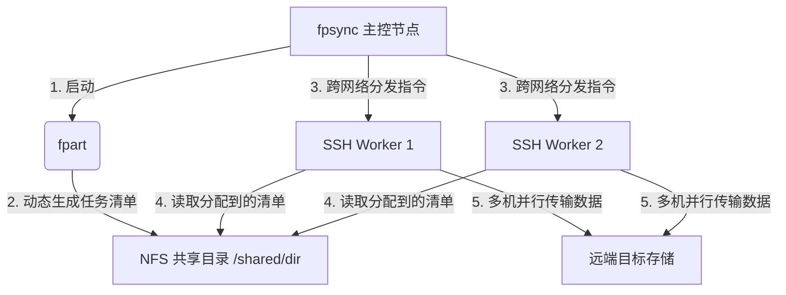

# 大规模数据并行迁移神器fpart & Fpsync


## 📌 一、 核心概念与底层架构设计

在传统的运维场景中，`rsync` 是数据同步的瑞士军刀。但在面对 PB 级数据或海量小文件（如千万级图片、日志）时，`rsync` 会暴露出致命缺陷：**单线程构建文件列表**。它必须先花数小时把所有文件扫描进内存，然后才开始慢吞吞地单线程传输。一旦中断，扫描工作全部重来。

为了攻克这一痛点，`fpart` 项目应运而生，它通过**"分区+并行"**的思想重新定义了大规模数据迁移。

### 1. 两者的核心关系与分工 🧩

`fpart` 项目包含两个核心组件，它们分工明确：

* **fpart (底层的“核心引擎”) 🛠️**：它是一个用 C 语言编写的超高性能文件系统分区器。它采用 **bin-packing（装箱）算法**，以极快的速度遍历文件树，并根据你指定的“文件数量”或“数据大小”，把庞大的文件树动态切分成一个个体量均衡的独立“任务块”。
* **fpsync (表层的“高级调度器”) 🚀**：它是一个基于 `fpart` 封装的 Shell 脚本。它实现了**“边爬取、边切分、边传输”**的流式工作流（Live Mode）。一边让 `fpart` 扫描切片，一边同时维护一个并发任务队列，调度多个本地进程（默认调用 `rsync`）或远程 SSH 节点来并行传输这些切片。

### 2. 底层工作架构设计图 📐

#### ① 本地并行模式（单机并发）

在这个模式下，`fpsync` 在本地高效压榨多核 CPU 和磁盘带宽。`fpart` 启用 Live 模式，无需等待全量扫描完毕，边扫描边生成分区清单（part.0, part.1...），调度器立即将这些清单派发给并行的 `rsync` 进程。



#### ② 远程分布式模式（多机器集群并发）

当你拥有多台机器和共享存储（如 NFS）时，`fpsync` 可以跨机器分发任务。主控节点上的 `fpart` 将生成的分区清单写入 NFS 共享目录，然后通过 SSH 指挥各个 Worker 节点读取清单并执行传输。



### 3. 核心难点攻克：目录元数据保真 🔬

并行传输 `cpio` 或 `tar` 时有一个经典难题：如果父目录和子文件被分到不同分区并行处理，目录的修改时间会被多次覆盖，导致元数据丢失。

**fpart 的解决方案**：fpsync 1.6.0 起，底层自动调用 fpart 的 `-zzz` 和 `-P` 参数。
- `-zzz`：把所有目录（包括空目录）作为 0 字节条目打包进分区。
- `-P`：在关闭每个分区时，自动补上该分区所有文件的父目录链。
这确保了无论分区以什么乱序被处理，父目录的元数据总是在最后被正确应用一次。

---

## 📥 二、 环境部署与安装指南

在绝大多数现代 Linux 发行版中，官方仓库已经收录了 `fpart`。**你只需要安装 `fpart`，即可自动获得 `fpsync` 命令**。

### 1. Ubuntu / Debian 系统的安装 🟠

```bash
# 1. 更新本地软件包索引
sudo apt update

# 2. 安装 fpart (fpsync 会随之自动安装)
sudo apt install fpart rsync -y
```

### 2. CentOS / RHEL / Rocky Linux 系统的安装 🔵

RHEL 系系统需先启用 EPEL 仓库：

```bash
# 1. 安装并启用 EPEL 仓库
sudo dnf install epel-release -y

# 2. 安装 fpart 和 rsync
sudo dnf install fpart rsync -y
```

### 3. FreeBSD 系统的安装 🐉

```bash
sudo pkg install sysutils/fpart
```

### 4. 安装验证 ✅

```bash
# 验证 fpart 引擎
fpart -V

# 验证 fpsync 调度器
# 注意：1.7.1 版本才新增了 -V 选项，如果你的版本是 1.7.0，请使用 fpsync -h
fpsync -h | head -n 5
```

---

## ⚡ 三、 新人快速上手：基础同步与核心参数拆解

### 1. 新人必看：两条铁律 ⚠️

在敲下任何同步命令前，必须死记以下两条规则，否则程序会直接报错：

* **铁律 1：路径必须是绝对路径！** 源目录和目标目录绝对不能写相对路径（如 `./data`），必须写完整路径（如 `/data/src/`）。
* **铁律 2：源目录结尾必须带斜杠 `/`！** `fpsync` 强制要求对源目录执行内容级同步。带有斜杠（如 `/src/`）代表同步目录下的**内容**。

### 2. 最基础的本地同步示例 📂

将本地的 `/data/source/` 目录下的所有文件同步到 `/data/destination/` 目录中：

```bash
fpsync /data/source/ /data/destination/
```

💡 **新人解惑**：当你什么参数都不加时，`fpsync` 默认会启动 **2 个并发任务**，每个同步任务块最多包含 **2000 个文件** 或最高 **4GB 的数据量**。

### 3. 控制并发与分块大小（核心调优） 🎛️

* `-n`：设置最大并行任务数（并发数）。
* `-f`：设置每个任务块最多包含多少个文件。
* `-s`：设置每个任务块的最大数据字节量（支持 k/m/g/t/p 后缀）。

**实战命令：** 启动 4 个并发任务，限制每个任务块最多处理 1000 个文件、大小不超过 100MB：

```bash
fpsync -n 4 -f 1000 -s 100m /data/source/ /data/destination/
```

### 4. 跨机器远程同步 🌐

通过 SSH 将本地数据安全地同步到远程服务器上：

```bash
fpsync -n 4 /data/source/ user@192.168.1.100:/data/destination/
```

*💡 **安全小贴士**：强烈建议在两台服务器之间配置好 **SSH 免密登录（密钥认证）**，否则在并发执行时系统会反复索要密码。*

### 5. 排除不需要同步的文件 🚫

如果你需要排除某些文件（如 `.snapshot` 或 `*.tmp`），需要使用 `-O` 参数透传给底层 `fpart`。
⚠️ **注意：语法极其特殊，必须用管道符 `|` 分隔选项和值！**

```bash
# 正确写法：排除 .snapshot* 和 *.tmp
fpsync -n 4 -O "-x|.snapshot*|-x|*.tmp" /data/source/ /data/destination/

# 错误写法：用空格分隔不会生效
# fpsync -O "-x .snapshot* -x *.tmp" ...
```

---

## 🛠️ 四、 任务管理与断点续传设计

海量数据同步往往需要数小时甚至数天，中途网络波动是家常便饭。`fpsync` 内置了极其强大的任务跟踪与断点续传机制。

### 1. 任务的生命周期管理命令 🔄

每个 `fpsync` 任务在启动时，都会被自动分配一个唯一的任务 ID（称为 `runid`）。

| 动作             | 命令语法               | 适用场景                                                                                            |
| ---------------- | ---------------------- | --------------------------------------------------------------------------------------------------- |
| **列出历史** 📄 | `fpsync -l`            | 查看过去和当前正在运行的所有同步任务及其状态                                                        |
| **断点续传** 🔁 | `fpsync -r <runid>`    | **最核心功能。** 任务中途意外中断后，输入该命令即可从上次失败的地方继续，绝不重复传输已成功的分区。 |
| **任务重放** 🔄 | `fpsync -r <runid> -R` | 强制重新同步该任务对应的所有分区，无论之前是否成功。适用于反复跑最终清理。 |
| **打包归档** 📦 | `fpsync -a <runid>`    | 将指定任务的运行日志和配置打包压缩，便于留存或分析。                                                |
| **清理删除** ❌  | `fpsync -D <runid>`    | 从系统中彻底抹除该同步任务的所有临时文件和记录。                                                          |

### 2. 完美的“断点续传”实战演练 🧭

* **第一步：** 正常运行一个大任务，假设中途由于网络断开崩溃了：
    ```bash
    fpsync -n 8 /bigdata/src/ /bigdata/dst/
    ```

* **第二步：** 待网络恢复后，查询刚才中断的任务 ID：
    ```bash
    fpsync -l
    # 终端会输出类似以下的信息：
    Run 20250101_120000_abc123: INTERRUPTED (partitions 5,6,7 pending)
    ```

* **第三步：** 一键恢复，无缝续传：
    ```bash
    fpsync -r 20250101_120000_abc123
    ```

---

## 🚀 五、 高级进阶：多节点集群并发与最佳实践

### 1. 跨多台机器的分布式数据迁移（SSH Workers） 📡

当单台机器的网卡或 CPU 算力达到极限时，我们可以拉上局域网内的其他机器一起来分担同步压力。

**前置绝对必要条件：**
1. **必须要有一个共享目录**（如 NFS 挂载），且主控节点和所有 Worker 节点都必须将该共享目录挂载到**完全相同的绝对路径**下。
2. 主控节点到所有 Worker 节点必须实现 **SSH 免密登录**。

**分布式实战命令：** 借助 `machine1` 和 `machine2` 两台外部机器，共同并发执行 8 个同步任务：

```bash
fpsync -n 8 \
  -w 'root@machine1 root@machine2' \
  -d /mnt/nfs/fpsync_shared/ \
  /mnt/nfs/source_data/ /mnt/nfs/destination_data/
```

🛠️ **参数拆解**：`-w` 后面指定 Worker 节点的 SSH 登录信息（空格分隔）；`-d` 指定它们都能共同读写的 NFS 共享目录路径。

### 2. 企业级黄金迁移法则：三阶段迁移法 🏆

经过大规模实战验证，最安全高效的迁移策略分为三个阶段（综合使用不同后端工具）：

```bash
# 1. 基线全量（用 cpio 后端，速度最快，目录元数据由底层 -zzz -P 修复）
fpsync -v -m cpio -n 16 /data/src/ /data/dst/

# 2. 增量同步（用默认 rsync 后端，捕获变更，建议跑多次）
fpsync -v -n 64 /data/src/ /data/dst/
fpsync -v -n 64 /data/src/ /data/dst/ 

# 3. 最终清理（加 -E 目录模式，删除目标端多余文件）
fpsync -v -E -n 64 /data/src/ /data/dst/
```

### 3. 最佳性能调优速查表 📊

根据你的实际硬件和文件类型，参考下表调整参数能让速度成倍提升：

| 数据场景特点 | 💡 建议并发数 (`-n`) | 📄 建议分块文件数 (`-f`) | 💾 建议分块大小限制 (`-s`) |
| --- | --- | --- | --- |
| **海量小文件** (如头像、小碎日志) | `16` 到 `64` | `5000` 到 `10000` | `100MB` 到 `500MB` |
| **常规混合文件** (日常办公文档、代码库) | `8` 到 `16` | `1000` 到 `2000` | `500MB` 到 `1GB` |
| **少量超大文件** (如高清视频、虚拟机镜像) | `4` 到 `8` | `0` (不限) | `4GB` 到 `16GB` |

---

## ⚠️ 六、 关键限制与故障排查

### 1. 无法直接支持硬链接 🔗

* **原因**：`rsync` 是在单次运行中收集硬链接元数据的。而 `fpart` 会把文件切碎到不同分区里，导致同一个硬链接的两个源文件极有可能被分到了不同的同步进程中，从而丢失硬链接属性。
* **避坑指南**：如果你必须完整保留硬链接，推荐方案：在 `fpsync` 大规模并行传输彻底完成后，最后用一次原生的单线程 `rsync -aH --delete /src/ /dst/` 命令进行全局硬链接修复。

### 2. 慎用 `-E`（按目录模式 / 最终数据对齐） 🚨

默认情况下，`fpsync` 是基于“文件列表”传输的，它不会删除目标目录中多余的文件。
如果你加上了 `-E` 选项，`fpsync` 会切换到“目录模式”并**自动强制启用 rsync 的 `--delete` 选项**。这意味着：**如果目标目录中存在某些源目录没有的文件，它们会被瞬间抹除！**

* **最佳实践推荐**：在迁移的前几天，不加 `-E` 跑多次增量同步；在正式业务割接的当天，加 `-E` 跑最后一次最终同步，实现两端数据的完美对齐。

### 3. 日志与排错路径 📂

当任务失败或卡住时，`fpsync` 的所有日志都保存在临时目录中（默认在 `/tmp/fpsync/fpsync.<runid>/` 下）：

* `fpsync.log`：调度器主日志，查看整体进度和报错。
* `logs/job.0.stderr`：**最重要的排错文件**。如果某个分区同步失败，这里会记录最底层的 `rsync` 报错信息（如权限不足、网络超时等）。

---

## 📋 七、 总结

`fpart` 与 `fpsync` 的核心魅力在于将“大任务化小，小任务并发”。它巧妙地将文件系统遍历与数据传输解耦，通过 Live Mode 实现了边遍历边传输的流水线作业。

只要你严格遵守“**绝对路径**”与“**源目录尾部加斜杠**”这两条铁律，避开 `-O` 参数的管道符语法陷阱，并灵活运用 `-n` 控制并发，你就能轻松驾驭任何 PB 级、千万级文件的极限数据迁移挑战！

---

> 作者: [0x5c0f](https://blog.0x5c0f.cc)  
> URL: http://localhost:1313/posts/linux/fpart-fpsync/  

