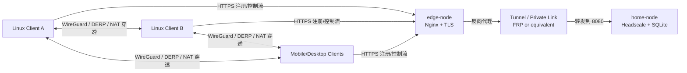

# 从零自建 Headscale 服务


# 从零自建 Headscale 控制平面：一套适合个人与家庭的 Tailscale 替代方案

> 这是一篇基于真实部署过程整理出来的复盘文档，已做脱敏处理。  
> 文中的真实域名、主机名、证书路径、密钥、节点名、代理地址均已替换。  
> 读者默认是 Linux 用户。  
> 本文重点是自建 `Headscale` 控制平面，客户端使用官方 `Tailscale`。

## 一、这篇文章解决什么问题

如果你有下面这些需求，这篇文章适合你：

1. 想自建一个个人或家庭使用的 Tailscale 控制平面
2. 不想把控制权完全交给官方 SaaS
3. 家里有一台长期在线的 Linux 机器
4. 还有一台公网可访问的边缘服务器
5. 愿意自己维护证书、反向代理和内网穿透
6. 希望后续还能统一管理用户、节点和接入命令

我最终采用的方案是：

1. 家里的 Linux 节点运行 `Headscale + SQLite`
2. 公网边缘节点运行 `Nginx`
3. 通过一条内网穿透或专线把边缘节点和家里节点打通
4. 对外只暴露一个 HTTPS 域名
5. 客户端使用官方 `Tailscale` 接入

## 二、最终架构

本文中的环境统一脱敏为：

- `home-node`：家里的 Headscale 控制平面节点
- `edge-node`：公网入口节点，负责 HTTPS 和反向代理
- `headscale.example.com`：对外控制平面域名



这里要注意两件事：

1. `Headscale` 负责控制面，也就是用户、节点、Auth Key、路由审批这些管理行为
2. 客户端之间的实际数据流量，仍然主要走 `Tailscale/WireGuard` 的点对点链路，而不是全部穿过你的 `Headscale`

## 三、前置条件

开始之前，建议先确认这些条件：

1. 你有一个域名，例如 `example.com`
2. 你有一个公网可访问的子域名，例如 `headscale.example.com`
3. `edge-node` 上已经能正确跑 Nginx，并有可用证书
4. `home-node` 能稳定联网
5. `edge-node` 和 `home-node` 之间已经能通过内网穿透或私网打通
6. 你愿意先用最小可用配置，不一开始就上 OIDC、MagicDNS、复杂 ACL

本文默认：

- 数据库使用 `SQLite`
- 反向代理使用 `Nginx`
- Linux 客户端优先
- 先关闭 `MagicDNS`
- 先使用最简单的 ACL 策略

## 四、版本说明

本文整理时，我实际核对到的版本是：

- 截至 `2026-04-03`
- `Headscale` 最新稳定版为 `v0.27.1`
- 客户端使用官方 `Tailscale Linux` 包

如果你看到这篇文章时版本已经更新，请优先看官方 Release 和文档。

## 五、在 home-node 上部署 Headscale

### 5.1 安装依赖

在 `home-node` 上执行：

```bash
sudo apt-get update
sudo apt-get install -y ca-certificates curl sqlite3
```

如果你是 Debian 12，这一步没有问题。  
官方其实更推荐使用 `headscale` 的 `.deb` 包，但我这次真实部署采用的是独立二进制 + 自定义 systemd，因为它更容易完全掌控目录和启动方式。

### 5.2 创建运行用户和目录

```bash
sudo groupadd --system headscale || true

id -u headscale >/dev/null 2>&1 || sudo useradd \
  --create-home \
  --home-dir /var/lib/headscale \
  --system \
  --gid headscale \
  --shell /usr/sbin/nologin \
  headscale

sudo install -d -m 0755 /etc/headscale
sudo install -d -o headscale -g headscale -m 0750 /var/lib/headscale
sudo install -d -o headscale -g headscale -m 0750 /var/run/headscale
```

### 5.3 下载 Headscale 二进制

如果网络没问题：

```bash
HEADSCALE_VERSION="0.27.1"
HEADSCALE_ARCH="amd64"

curl -fsSL -o /tmp/headscale \
  "https://github.com/juanfont/headscale/releases/download/v${HEADSCALE_VERSION}/headscale_${HEADSCALE_VERSION}_linux_${HEADSCALE_ARCH}"

sudo install -m 0755 /tmp/headscale /usr/local/bin/headscale
headscale version
```

如果你的环境下载 GitHub 容易失败，可以显式走代理：

```bash
curl -fsSL --proxy socks5h://127.0.0.1:7891 -o /tmp/headscale \
  "https://github.com/juanfont/headscale/releases/download/v${HEADSCALE_VERSION}/headscale_${HEADSCALE_VERSION}_linux_${HEADSCALE_ARCH}"
```

### 5.4 初始化 SQLite 数据库

```bash
sudo install -o headscale -g headscale -m 0640 /dev/null /var/lib/headscale/db.sqlite
sudo -u headscale sqlite3 /var/lib/headscale/db.sqlite 'PRAGMA journal_mode=WAL;'
```

说明：

1. 这一步只是先创建数据库文件并启用 `WAL`
2. 表结构会在 `headscale serve` 首次启动时自动初始化

### 5.5 写入最小可用配置

创建 `/etc/headscale/config.yaml`：

```yaml
server_url: https://headscale.example.com
listen_addr: 0.0.0.0:8080
metrics_listen_addr: 127.0.0.1:9090
grpc_listen_addr: 127.0.0.1:50443
grpc_allow_insecure: false

noise:
  private_key_path: /var/lib/headscale/noise_private.key

prefixes:
  v4: 100.64.0.0/10
  v6: fd7a:115c:a1e0::/48

allocation: sequential

derp:
  server:
    enabled: false
  urls:
    - https://controlplane.tailscale.com/derpmap/default
  paths: []
  auto_update_enabled: true
  update_frequency: 3h

disable_check_updates: true
ephemeral_node_inactivity_timeout: 30m

database:
  type: sqlite
  debug: false
  gorm:
    prepare_stmt: true
    parameterized_queries: true
    skip_err_record_not_found: true
    slow_threshold: 1000
  sqlite:
    path: /var/lib/headscale/db.sqlite
    write_ahead_log: true
    wal_autocheckpoint: 1000

tls_cert_path: ""
tls_key_path: ""

log:
  level: info
  format: text

policy:
  mode: file
  path: /etc/headscale/acl.hujson

dns:
  magic_dns: false
  base_domain: tail.example.com
  override_local_dns: false
  nameservers:
    global: []
  search_domains: []
  extra_records: []

unix_socket: /var/run/headscale/headscale.sock
unix_socket_permission: "0770"

logtail:
  enabled: false

randomize_client_port: false
```

再修正权限：

```bash
sudo chown root:headscale /etc/headscale/config.yaml
sudo chmod 0640 /etc/headscale/config.yaml
```

### 5.6 写入最小 ACL

创建 `/etc/headscale/acl.hujson`：

```json
{}
```

再修正权限：

```bash
sudo chown root:headscale /etc/headscale/acl.hujson
sudo chmod 0640 /etc/headscale/acl.hujson
```

这里我一开始采用的是最小 ACL。  
这样做的原因很简单：先把整条链路跑通，再谈收敛策略。

### 5.7 配置 systemd

创建 `/etc/systemd/system/headscale.service`：

```ini
[Unit]
Description=Headscale Control Server
Documentation=https://headscale.net/stable/
After=network-online.target
Wants=network-online.target

[Service]
Type=simple
User=headscale
Group=headscale
WorkingDirectory=/var/lib/headscale
ExecStart=/usr/local/bin/headscale serve
ExecReload=/bin/kill -HUP $MAINPID
Restart=on-failure
RestartSec=5s
RuntimeDirectory=headscale
RuntimeDirectoryMode=0750
NoNewPrivileges=true
PrivateTmp=true
ProtectSystem=strict
ProtectHome=true
ReadWritePaths=/var/lib/headscale /var/run/headscale

[Install]
WantedBy=multi-user.target
```

### 5.8 先做 configtest，再启动服务

注意：这里最好用 `headscale` 用户来执行 `configtest`。

```bash
sudo -u headscale headscale configtest
sudo systemctl daemon-reload
sudo systemctl enable --now headscale
sudo systemctl status headscale --no-pager
```

### 5.9 本机健康检查

```bash
curl http://127.0.0.1:8080/health
```

如果正常，应该返回：

```json
{"status":"pass"}
```

## 六、在 edge-node 上配置 Nginx 反向代理

### 6.1 为什么要有 edge-node

我的实际拓扑里，`home-node` 不直接暴露在公网。  
对外暴露的是 `edge-node`，它负责：

1. 终止 TLS
2. 暴露 `headscale.example.com`
3. 反向代理到边缘节点本地的落地端口
4. 这个落地端口再由内网穿透或私网连接转发到 `home-node:8080`

你完全可以把这理解成：

- `edge-node` 是门面
- `home-node` 是真正的 Headscale

### 6.2 Nginx 配置

假设：

- `headscale.example.com` 已经解析到 `edge-node`
- `edge-node` 上本地 `127.0.0.1:18080` 已经映射到 `home-node:8080`
- 证书已经可用

Nginx 配置可以是这样：

```nginx
server {
    listen 80;
    listen [::]:80;
    server_name headscale.example.com;

    return 301 https://$host$request_uri;
}

server {
    listen 443 ssl;
    listen [::]:443 ssl;
    http2 on;

    server_name headscale.example.com;

    access_log /var/log/nginx/headscale.example.com.access.log;
    error_log  /var/log/nginx/headscale.example.com.error.log;

    ssl_certificate     /etc/nginx/ssl/example.com/fullchain.pem;
    ssl_certificate_key /etc/nginx/ssl/example.com/privkey.pem;

    location / {
        proxy_pass http://127.0.0.1:18080;

        proxy_http_version 1.1;
        proxy_buffering off;
        proxy_read_timeout 3600;
        proxy_send_timeout 3600;

        proxy_set_header Upgrade $http_upgrade;
        proxy_set_header Connection $connection_upgrade;
        proxy_set_header Host $host;
        proxy_set_header X-Real-IP $remote_addr;
        proxy_set_header X-Forwarded-For $proxy_add_x_forwarded_for;
        proxy_set_header X-Forwarded-Proto $scheme;
        proxy_set_header X-Forwarded-Host $host;
        proxy_set_header X-Forwarded-Port $server_port;

        proxy_redirect http:// https://;
    }
}
```

如果你的全局配置里还没有这段，需要在 `http {}` 里定义：

```nginx
map $http_upgrade $connection_upgrade {
    default upgrade;
    ''      close;
}
```

### 6.3 检查 Nginx

```bash
nginx -t
nginx -s reload
```

### 6.4 逐层检查链路

建议按这三个层次检查：

在 `home-node` 上：

```bash
curl http://127.0.0.1:8080/health
```

在 `edge-node` 上：

```bash
curl http://127.0.0.1:18080/health
```

在任意外部机器上：

```bash
curl -I https://headscale.example.com/health
```

我的实际排障过程里，曾经出现过：

- 本机 `200`
- Nginx `502`

这种情况通常不是 Headscale 挂了，而是边缘节点到内网节点的映射还没打通。

## 七、创建第一个用户和第一个接入 Key

### 7.1 创建用户

```bash
headscale users create home
headscale users list
```

### 7.2 创建预认证 Key

需要注意一个版本细节：

在我这次用的版本里，`preauthkeys create --user` 接受的是 **用户 ID**，不是用户名。

也就是说要写：

```bash
headscale preauthkeys create --user 1
```

而不是：

```bash
headscale preauthkeys create --user home
```

例如创建一个 24 小时有效的一次性 Key：

```bash
headscale preauthkeys create --user 1 --expiration 24h
```

如果你想给家庭多台设备复用一条 Key，可以这么做：

```bash
headscale preauthkeys create --user 1 --expiration 30d --reusable
```

## 八、第一台 Linux 客户端接入

### 8.1 安装 Tailscale

官方 Linux 安装方法：

```bash
curl -fsSL https://tailscale.com/install.sh | sh
```

如果你环境里需要代理，先把代理环境准备好，或者让脚本自己处理。

### 8.2 正式接入

```bash
sudo tailscale up \
  --login-server https://headscale.example.com \
  --auth-key <你的-auth-key> \
  --accept-dns=false
```

这里我显式加了：

```bash
--accept-dns=false
```

原因很现实：  
我在真实环境里第一次接入时，碰到过 `/etc/resolv.conf` 权限告警。  
先关闭客户端接管 DNS，可以减少初次接入的干扰。

### 8.3 查看接入结果

```bash
tailscale status
tailscale ip -4
```

如果正常，你会看到类似：

```text
100.64.0.1  laptop  home  linux  -
```

这就表示：

1. 节点已经成功加入你的 tailnet
2. 归属用户是 `home`
3. 已分配 `100.x.x.x` 地址

### 8.4 服务端查看节点

```bash
headscale nodes list
```

## 九、如何理解“其他机器怎么加入”

这个问题我当时自己也专门确认过。

答案是：

**每一台要加入 tailnet 的机器，都要各自执行一次 `tailscale up`。**

不是在一台机器上执行一次，全网就自动进来。

正确理解是：

1. `Headscale` 管的是控制面
2. 每个客户端要自己安装 `Tailscale`
3. 每个客户端要自己执行一次接入命令
4. 每个客户端会各自注册成一个节点

所以：

- A 机器执行一次，A 加入
- B 机器执行一次，B 加入
- C 机器执行一次，C 加入

## 十、统一管理脚本 `hsctl`

部署完成后，我又补了一层统一管理脚本 `hsctl`，解决两个痛点：

1. 服务端命令太散，不方便统一操作
2. 新机器第一次接入时，希望能自动初始化，而不是每台都手敲一堆命令

`hsctl`: 
```bash
#!/usr/bin/env bash
set -euo pipefail

SCRIPT_NAME="${0##*/}"
SCRIPT_VERSION="0.2.0"
HEADSCALE_CONFIG="${HEADSCALE_CONFIG:-/etc/headscale/config.yaml}"
DEFAULT_LOGIN_SERVER="${HEADSCALE_SERVER_URL:-https://headscale.0x5c0f.cc}"
DEFAULT_BIN_DIR="/usr/local/bin"
DEFAULT_PROXY="${HSCTL_PROXY:-${ALL_PROXY:-${HTTPS_PROXY:-${HTTP_PROXY:-}}}}"

has_cmd() {
  command -v "$1" >/dev/null 2>&1
}

need_cmd() {
  has_cmd "$1" || die "缺少命令: $1"
}

info() {
  printf '[INFO] %s\n' "$*" >&2
}

warn() {
  printf '[WARN] %s\n' "$*" >&2
}

die() {
  printf '[ERROR] %s\n' "$*" >&2
  exit 1
}

is_int() {
  [[ "${1:-}" =~ ^[0-9]+$ ]]
}

run_as_root() {
  if [ "$(id -u)" -eq 0 ]; then
    "$@"
  elif has_cmd sudo; then
    sudo "$@"
  else
    die "需要 root 或 sudo 权限: $*"
  fi
}

hs() {
  need_cmd headscale
  run_as_root headscale -c "$HEADSCALE_CONFIG" --force "$@"
}

ts_ro() {
  need_cmd tailscale
  tailscale "$@"
}

ts_rw() {
  need_cmd tailscale
  run_as_root tailscale "$@"
}

need_python() {
  need_cmd python3
}

resolve_self_path() {
  local src
  src="${BASH_SOURCE[0]}"
  if has_cmd readlink; then
    src="$(readlink -f "$src" 2>/dev/null || printf '%s' "$src")"
  fi
  [ -f "$src" ] || die "无法定位当前脚本路径，请先把脚本保存为文件再执行。"
  printf '%s\n' "$src"
}

install_self() {
  local bin_dir="${1:-$DEFAULT_BIN_DIR}"
  local src target
  src="$(resolve_self_path)"
  target="$bin_dir/hsctl"
  run_as_root install -d -m 0755 "$bin_dir"
  if [ "$src" = "$target" ]; then
    info "脚本已经在 $target"
    return
  fi
  run_as_root install -m 0755 "$src" "$target"
  info "已安装脚本到 $target"
}

pkg_manager() {
  if has_cmd apt-get; then
    echo apt
  elif has_cmd dnf; then
    echo dnf
  elif has_cmd yum; then
    echo yum
  elif has_cmd zypper; then
    echo zypper
  elif has_cmd pacman; then
    echo pacman
  else
    echo unknown
  fi
}

install_packages() {
  [ $# -gt 0 ] || return 0
  case "$(pkg_manager)" in
    apt)
      run_as_root apt-get update
      run_as_root apt-get install -y "$@"
      ;;
    dnf)
      run_as_root dnf install -y "$@"
      ;;
    yum)
      run_as_root yum install -y "$@"
      ;;
    zypper)
      run_as_root zypper --non-interactive install "$@"
      ;;
    pacman)
      run_as_root pacman -Sy --noconfirm "$@"
      ;;
    *)
      die "无法识别包管理器，无法自动安装: $*"
      ;;
  esac
}

ensure_curl() {
  if has_cmd curl; then
    return
  fi
  info "系统缺少 curl，开始自动安装 curl 和 ca-certificates"
  install_packages curl ca-certificates
}

systemctl_has_unit() {
  local unit="$1"
  has_cmd systemctl || return 1
  systemctl list-unit-files "$unit" >/dev/null 2>&1
}

ensure_service_started() {
  local unit="$1"
  if systemctl_has_unit "$unit"; then
    run_as_root systemctl enable --now "$unit"
  else
    warn "系统中未发现 systemd 单元 $unit，已跳过 enable/start"
  fi
}

extract_json_value() {
  local field="$1"
  local json
  json="$(cat)"
  need_python
  python3 -c '
import json, sys
field = sys.argv[1].split(".")
obj = json.load(sys.stdin)
value = obj
for part in field:
    if not isinstance(value, dict):
        raise SystemExit(f"field not found: {sys.argv[1]}")
    value = value.get(part)
if value is None:
    raise SystemExit(f"field not found: {sys.argv[1]}")
print(str(value).lower() if isinstance(value, bool) else value)
' "$field" <<<"$json"
}

resolve_user_id() {
  local ident="${1:-}"
  [ -n "$ident" ] || die "缺少用户标识"
  if is_int "$ident"; then
    printf '%s\n' "$ident"
    return
  fi
  local json
  json="$(hs users list -o json)"
  need_python
  python3 -c '
import json, sys
ident = sys.argv[1]
data = json.load(sys.stdin)
matches = [str(item["id"]) for item in data if item.get("name") == ident]
if len(matches) == 1:
    print(matches[0])
    raise SystemExit(0)
if not matches:
    print(f"user not found: {ident}", file=sys.stderr)
else:
    print(f"multiple users match: {ident}", file=sys.stderr)
raise SystemExit(1)
' "$ident" <<<"$json"
}

resolve_user_name() {
  local ident="${1:-}"
  [ -n "$ident" ] || die "缺少用户标识"
  if ! is_int "$ident"; then
    printf '%s\n' "$ident"
    return
  fi
  local json
  json="$(hs users list -o json)"
  need_python
  python3 -c '
import json, sys
ident = int(sys.argv[1])
for item in json.load(sys.stdin):
    if item.get("id") == ident:
        print(item.get("name"))
        raise SystemExit(0)
print(f"user not found: {ident}", file=sys.stderr)
raise SystemExit(1)
' "$ident" <<<"$json"
}

resolve_node_id() {
  local ident="${1:-}"
  [ -n "$ident" ] || die "缺少节点标识"
  if is_int "$ident"; then
    printf '%s\n' "$ident"
    return
  fi
  local json
  json="$(hs nodes list -o json)"
  need_python
  python3 -c '
import json, sys
ident = sys.argv[1]
data = json.load(sys.stdin)
matches = [str(item["id"]) for item in data if item.get("name") == ident or item.get("given_name") == ident]
if len(matches) == 1:
    print(matches[0])
    raise SystemExit(0)
if not matches:
    print(f"node not found: {ident}", file=sys.stderr)
else:
    print(f"multiple nodes match: {ident}", file=sys.stderr)
raise SystemExit(1)
' "$ident" <<<"$json"
}

show_user_json() {
  local ident="$1"
  local json
  json="$(hs users list -o json)"
  need_python
  python3 -c '
import json, sys
ident = sys.argv[1]
data = json.load(sys.stdin)
want_id = ident.isdigit()
for item in data:
    if (want_id and item.get("id") == int(ident)) or ((not want_id) and item.get("name") == ident):
        print(json.dumps(item, indent=2, ensure_ascii=False))
        raise SystemExit(0)
print(f"user not found: {ident}", file=sys.stderr)
raise SystemExit(1)
' "$ident" <<<"$json"
}

show_node_json() {
  local ident="$1"
  local json
  json="$(hs nodes list -o json)"
  need_python
  python3 -c '
import json, sys
ident = sys.argv[1]
data = json.load(sys.stdin)
want_id = ident.isdigit()
for item in data:
    if (want_id and item.get("id") == int(ident)) or ((not want_id) and (item.get("name") == ident or item.get("given_name") == ident)):
        print(json.dumps(item, indent=2, ensure_ascii=False))
        raise SystemExit(0)
print(f"node not found: {ident}", file=sys.stderr)
raise SystemExit(1)
' "$ident" <<<"$json"
}

show_key_json() {
  local user_id="$1"
  local key="$2"
  local json
  json="$(hs preauthkeys list -u "$user_id" -o json)"
  need_python
  python3 -c '
import json, sys
want = sys.argv[1]
for item in json.load(sys.stdin):
    if item.get("key") == want:
        print(json.dumps(item, indent=2, ensure_ascii=False))
        raise SystemExit(0)
print(f"preauth key not found: {want}", file=sys.stderr)
raise SystemExit(1)
' "$key" <<<"$json"
}

create_key_json() {
  local user_id="$1"
  local expiration="$2"
  local reusable="$3"
  local ephemeral="$4"
  local tags="$5"
  local args
  args=(preauthkeys create -u "$user_id" --expiration "$expiration" -o json)
  [ "$reusable" = "1" ] && args+=(--reusable)
  [ "$ephemeral" = "1" ] && args+=(--ephemeral)
  [ -n "$tags" ] && args+=(--tags "$tags")
  hs "${args[@]}"
}

ensure_tailscale_installed() {
  local proxy="${1:-$DEFAULT_PROXY}"
  if has_cmd tailscale && has_cmd tailscaled; then
    info "检测到 tailscale/tailscaled 已安装，跳过安装步骤"
    return
  fi
  ensure_curl
  local tmp
  tmp="$(mktemp)"
  trap 'rm -f "$tmp"' RETURN
  info "按照 Tailscale 官方 Linux 安装方式下载 install.sh"
  if [ -n "$proxy" ]; then
    curl -fsSL --proxy "$proxy" -o "$tmp" https://tailscale.com/install.sh
  else
    curl -fsSL -o "$tmp" https://tailscale.com/install.sh
  fi
  run_as_root sh "$tmp"
  rm -f "$tmp"
  trap - RETURN
}

require_tailscale_set() {
  need_cmd tailscale
  tailscale set --help >/dev/null 2>&1 || die "当前 tailscale 版本不支持 'tailscale set'，请改用 client join 或升级 tailscale。"
}

client_join_impl() {
  local authkey="$1"
  shift
  local server_url="$DEFAULT_LOGIN_SERVER"
  local hostname=""
  local accept_dns="false"
  local accept_routes="false"
  local advertise_routes=""
  local advertise_tags=""
  local enable_ssh="0"
  local advertise_exit_node="0"
  while [ $# -gt 0 ]; do
    case "$1" in
      --server|--login-server)
        [ $# -ge 2 ] || die "参数 $1 缺少值"
        server_url="$2"
        shift 2
        ;;
      --hostname)
        [ $# -ge 2 ] || die "参数 $1 缺少值"
        hostname="$2"
        shift 2
        ;;
      --accept-dns)
        [ $# -ge 2 ] || die "参数 $1 缺少值"
        accept_dns="$2"
        shift 2
        ;;
      --accept-routes)
        [ $# -ge 2 ] || die "参数 $1 缺少值"
        accept_routes="$2"
        shift 2
        ;;
      --advertise-routes)
        [ $# -ge 2 ] || die "参数 $1 缺少值"
        advertise_routes="$2"
        shift 2
        ;;
      --advertise-tags)
        [ $# -ge 2 ] || die "参数 $1 缺少值"
        advertise_tags="$2"
        shift 2
        ;;
      --ssh)
        enable_ssh="1"
        shift
        ;;
      --advertise-exit-node)
        advertise_exit_node="1"
        shift
        ;;
      *)
        die "未知 client join 参数: $1"
        ;;
    esac
  done
  ensure_service_started tailscaled.service
  local args
  args=(up "--login-server=$server_url" "--auth-key=$authkey" "--accept-dns=$accept_dns" "--accept-routes=$accept_routes")
  [ -n "$hostname" ] && args+=("--hostname=$hostname")
  [ -n "$advertise_routes" ] && args+=("--advertise-routes=$advertise_routes")
  [ -n "$advertise_tags" ] && args+=("--advertise-tags=$advertise_tags")
  [ "$enable_ssh" = "1" ] && args+=(--ssh)
  [ "$advertise_exit_node" = "1" ] && args+=(--advertise-exit-node)
  ts_rw "${args[@]}"
}

usage() {
  cat <<EOF
$SCRIPT_NAME v$SCRIPT_VERSION

统一的 Headscale / Tailscale 管理脚本。

模式说明：
  $SCRIPT_NAME server ...    在 Headscale 控制平面服务器上执行，管理用户、节点、Auth Key 和服务状态。
  $SCRIPT_NAME client ...    在安装了 Tailscale 的客户端机器上执行，初始化客户端、加入网络、查看状态等。

最常用命令：
  $SCRIPT_NAME server init
    初始化服务端脚本环境：校验 headscale 配置、检查 systemd 服务，并把脚本安装到 /usr/local/bin/hsctl。

  $SCRIPT_NAME server join-cmd home --mode hsctl --cmd ./hsctl.sh --hostname laptop
    生成一条“新机器下载脚本后可直接执行”的接入命令。

  $SCRIPT_NAME client init --self-install --authkey <key> --hostname laptop
    在新客户端上初始化：安装 tailscale、启动 tailscaled、把脚本安装为 hsctl，并直接加入你的 Headscale。

  $SCRIPT_NAME client status
    查看当前客户端是否已经连入 tailnet。

环境变量：
  HEADSCALE_CONFIG       Headscale 配置文件路径，默认 /etc/headscale/config.yaml
  HEADSCALE_SERVER_URL   登录服务器地址，默认 $DEFAULT_LOGIN_SERVER
  HSCTL_PROXY            初始化时下载 tailscale 安装脚本使用的代理，如 socks5h://192.168.1.4:7891
EOF
}

server_usage() {
  cat <<EOF
服务端命令：
  $SCRIPT_NAME server init [--self-install|--no-self-install] [--bin-dir DIR] [--start|--no-start]
    初始化服务端脚本环境：校验 headscale 是否可用、运行 configtest，可选启动/拉起 systemd 服务，并把脚本安装到指定目录。

  $SCRIPT_NAME server health
    查看 headscale 健康状态。

  $SCRIPT_NAME server configtest
    校验当前 Headscale 配置文件是否合法。

  $SCRIPT_NAME server service status|logs [N]|restart
    管理 headscale systemd 服务：查看状态、查看日志、重启服务。

  $SCRIPT_NAME server users list [--json]
    列出全部用户。

  $SCRIPT_NAME server users show <user|id>
    查看指定用户的详细 JSON 信息。

  $SCRIPT_NAME server users id <user>
    把用户名解析成用户 ID，便于后续脚本化操作。

  $SCRIPT_NAME server users create <name> [--display-name X] [--email X] [--picture-url X]
    创建新用户。

  $SCRIPT_NAME server users rename <user|id> <new-name>
    重命名用户。

  $SCRIPT_NAME server users delete <user|id>
    删除用户。

  $SCRIPT_NAME server nodes list [--user <user|id>] [--json] [--tags]
    列出节点，可按用户过滤，也可带标签显示。

  $SCRIPT_NAME server nodes show <node|id>
    查看节点详细 JSON 信息。

  $SCRIPT_NAME server nodes rename <node|id> <new-name>
    重命名节点。

  $SCRIPT_NAME server nodes move <node|id> <user|id>
    把节点转移到另一个用户名下。

  $SCRIPT_NAME server nodes expire <node|id> [RFC3339]
    让节点立即失效或按指定时间失效，节点会被迫重新认证。

  $SCRIPT_NAME server nodes delete <node|id>
    删除节点。

  $SCRIPT_NAME server nodes routes <node|id>
    查看某个节点声明的路由。

  $SCRIPT_NAME server nodes approve-routes <node|id> <route1,route2>
    批准节点声明的子网路由。

  $SCRIPT_NAME server nodes tag <node|id> <tag:foo,tag:bar>
    给节点打标签。

  $SCRIPT_NAME server keys list <user|id> [--json]
    列出某个用户的 preauth keys。

  $SCRIPT_NAME server keys show <user|id> <key>
    查看指定 key 的详细信息。

  $SCRIPT_NAME server keys create <user|id> [--expiration 24h] [--reusable] [--ephemeral] [--tags tag:a,tag:b] [--json]
    为某个用户创建新的 preauth key；默认输出 key 本身。

  $SCRIPT_NAME server keys expire <user|id> <key>
    立即吊销某条 preauth key。

  $SCRIPT_NAME server join-cmd <user|id> [--expiration 24h] [--reusable] [--ephemeral] [--tags tag:a,tag:b] [--hostname NAME] [--server URL] [--accept-dns false] [--accept-routes false] [--mode tailscale|hsctl] [--cmd hsctl]
    生成一条新机器接入命令：
      mode=tailscale 输出原生 tailscale up 命令；
      mode=hsctl 输出基于本脚本的 client init 命令，适合“先下载脚本，再直接初始化+入网”的场景。

  $SCRIPT_NAME server raw <headscale args...>
    透传原生 headscale 命令。
EOF
}

client_usage() {
  cat <<EOF
客户端命令：
  $SCRIPT_NAME client init [--self-install|--no-self-install] [--bin-dir DIR] [--proxy URL] [--authkey KEY] [--server URL] [--hostname NAME] [--accept-dns false] [--accept-routes false] [--advertise-routes CIDR[,CIDR]] [--advertise-tags tag:a,tag:b] [--ssh] [--advertise-exit-node]
    新机器初始化入口：
      1. 如未安装 tailscale，则按 Tailscale 官方 Linux install.sh 自动安装；
      2. 拉起 tailscaled 服务；
      3. 可把当前脚本自安装为 /usr/local/bin/hsctl；
      4. 如果提供 --authkey，则初始化后立即加入你的 Headscale 网络。

  $SCRIPT_NAME client version
    查看本机 tailscale 客户端版本。

  $SCRIPT_NAME client status
    查看当前客户端状态。

  $SCRIPT_NAME client status-json
    以 JSON 形式输出客户端状态，便于脚本处理。

  $SCRIPT_NAME client ip
    查看本机分配到的 Tailscale IPv4 / IPv6 地址。

  $SCRIPT_NAME client join <authkey> [--server URL] [--hostname NAME] [--accept-dns false] [--accept-routes false] [--advertise-routes CIDR[,CIDR]] [--advertise-tags tag:a,tag:b] [--ssh] [--advertise-exit-node]
    让当前机器加入你的 Headscale 网络。

  $SCRIPT_NAME client dns on|off
    开启或关闭客户端接受 Headscale/Tailscale 下发的 DNS 配置。

  $SCRIPT_NAME client routes on|off
    开启或关闭客户端接受子网路由。

  $SCRIPT_NAME client ping <ip-or-name>
    通过 tailscale ping 测试到目标节点的连通性。

  $SCRIPT_NAME client logout
    让当前机器退出 tailnet。

  $SCRIPT_NAME client raw <tailscale args...>
    透传原生 tailscale 命令。
EOF
}

server_service() {
  local action="${1:-status}"
  case "$action" in
    status)
      run_as_root systemctl --no-pager --full status headscale
      ;;
    logs)
      local lines="${2:-100}"
      run_as_root journalctl -u headscale -n "$lines" --no-pager
      ;;
    restart)
      run_as_root systemctl restart headscale
      run_as_root systemctl --no-pager --full status headscale | sed -n '1,20p'
      ;;
    *)
      die "未知服务动作: $action"
      ;;
  esac
}

server_init() {
  local self_install="1"
  local bin_dir="$DEFAULT_BIN_DIR"
  local start_service="1"
  while [ $# -gt 0 ]; do
    case "$1" in
      --self-install)
        self_install="1"
        shift
        ;;
      --no-self-install)
        self_install="0"
        shift
        ;;
      --bin-dir)
        [ $# -ge 2 ] || die "参数 $1 缺少值"
        bin_dir="$2"
        shift 2
        ;;
      --start)
        start_service="1"
        shift
        ;;
      --no-start)
        start_service="0"
        shift
        ;;
      *)
        die "未知 server init 参数: $1"
        ;;
    esac
  done
  [ "$self_install" = "1" ] && install_self "$bin_dir"
  need_cmd headscale
  [ -f "$HEADSCALE_CONFIG" ] || die "未找到 Headscale 配置文件: $HEADSCALE_CONFIG"
  info "开始校验 Headscale 配置"
  hs configtest
  if [ "$start_service" = "1" ] && systemctl_has_unit headscale.service; then
    info "尝试拉起 headscale.service"
    run_as_root systemctl enable --now headscale.service
  fi
  if systemctl_has_unit headscale.service; then
    run_as_root systemctl --no-pager --full status headscale.service | sed -n '1,15p'
  else
    warn "未发现 headscale.service，已跳过 systemd 状态检查"
  fi
}

server_users() {
  local action="${1:-list}"
  shift || true
  case "$action" in
    list)
      if [ "${1:-}" = "--json" ]; then
        hs users list -o json
      else
        hs users list
      fi
      ;;
    show)
      [ $# -ge 1 ] || die "用法: $SCRIPT_NAME server users show <user|id>"
      show_user_json "$1"
      ;;
    id)
      [ $# -ge 1 ] || die "用法: $SCRIPT_NAME server users id <user|id>"
      resolve_user_id "$1"
      ;;
    create)
      [ $# -ge 1 ] || die "用法: $SCRIPT_NAME server users create <name> [--display-name X] [--email X] [--picture-url X]"
      local name="$1"
      shift
      local args
      args=(users create "$name")
      while [ $# -gt 0 ]; do
        case "$1" in
          --display-name|--email|--picture-url)
            [ $# -ge 2 ] || die "参数 $1 缺少值"
            args+=("$1" "$2")
            shift 2
            ;;
          *)
            die "未知 users create 参数: $1"
            ;;
        esac
      done
      hs "${args[@]}"
      ;;
    rename)
      [ $# -ge 2 ] || die "用法: $SCRIPT_NAME server users rename <user|id> <new-name>"
      if is_int "$1"; then
        hs users rename -i "$1" -r "$2"
      else
        hs users rename -n "$1" -r "$2"
      fi
      ;;
    delete|destroy)
      [ $# -ge 1 ] || die "用法: $SCRIPT_NAME server users delete <user|id>"
      if is_int "$1"; then
        hs users destroy -i "$1"
      else
        hs users destroy -n "$1"
      fi
      ;;
    raw)
      hs users "$@"
      ;;
    *)
      die "未知 users 动作: $action"
      ;;
  esac
}

server_nodes() {
  local action="${1:-list}"
  shift || true
  case "$action" in
    list)
      local user=""
      local want_json="0"
      local want_tags="0"
      local args
      args=(nodes list)
      while [ $# -gt 0 ]; do
        case "$1" in
          --user|-u)
            [ $# -ge 2 ] || die "参数 $1 缺少值"
            user="$2"
            shift 2
            ;;
          --json)
            want_json="1"
            shift
            ;;
          --tags)
            want_tags="1"
            shift
            ;;
          *)
            die "未知 nodes list 参数: $1"
            ;;
        esac
      done
      [ -n "$user" ] && args+=(-u "$(resolve_user_name "$user")")
      [ "$want_tags" = "1" ] && args+=(-t)
      [ "$want_json" = "1" ] && args+=(-o json)
      hs "${args[@]}"
      ;;
    show)
      [ $# -ge 1 ] || die "用法: $SCRIPT_NAME server nodes show <node|id>"
      show_node_json "$1"
      ;;
    rename)
      [ $# -ge 2 ] || die "用法: $SCRIPT_NAME server nodes rename <node|id> <new-name>"
      hs nodes rename -i "$(resolve_node_id "$1")" "$2"
      ;;
    move)
      [ $# -ge 2 ] || die "用法: $SCRIPT_NAME server nodes move <node|id> <user|id>"
      hs nodes move -i "$(resolve_node_id "$1")" -u "$(resolve_user_id "$2")"
      ;;
    expire)
      [ $# -ge 1 ] || die "用法: $SCRIPT_NAME server nodes expire <node|id> [RFC3339]"
      local node_id
      node_id="$(resolve_node_id "$1")"
      if [ $# -ge 2 ]; then
        hs nodes expire -i "$node_id" -e "$2"
      else
        hs nodes expire -i "$node_id"
      fi
      ;;
    delete)
      [ $# -ge 1 ] || die "用法: $SCRIPT_NAME server nodes delete <node|id>"
      hs nodes delete -i "$(resolve_node_id "$1")"
      ;;
    routes)
      [ $# -ge 1 ] || die "用法: $SCRIPT_NAME server nodes routes <node|id>"
      hs nodes list-routes -i "$(resolve_node_id "$1")"
      ;;
    approve-routes)
      [ $# -ge 2 ] || die "用法: $SCRIPT_NAME server nodes approve-routes <node|id> <route1,route2>"
      hs nodes approve-routes -i "$(resolve_node_id "$1")" -r "$2"
      ;;
    tag)
      [ $# -ge 2 ] || die "用法: $SCRIPT_NAME server nodes tag <node|id> <tag:foo,tag:bar>"
      hs nodes tag -i "$(resolve_node_id "$1")" -t "$2"
      ;;
    raw)
      hs nodes "$@"
      ;;
    *)
      die "未知 nodes 动作: $action"
      ;;
  esac
}

server_keys() {
  local action="${1:-list}"
  shift || true
  case "$action" in
    list)
      [ $# -ge 1 ] || die "用法: $SCRIPT_NAME server keys list <user|id> [--json]"
      local user_id
      user_id="$(resolve_user_id "$1")"
      shift
      if [ "${1:-}" = "--json" ]; then
        hs preauthkeys list -u "$user_id" -o json
      else
        hs preauthkeys list -u "$user_id"
      fi
      ;;
    show)
      [ $# -ge 2 ] || die "用法: $SCRIPT_NAME server keys show <user|id> <key>"
      local show_user_id
      show_user_id="$(resolve_user_id "$1")"
      show_key_json "$show_user_id" "$2"
      ;;
    create)
      [ $# -ge 1 ] || die "用法: $SCRIPT_NAME server keys create <user|id> [--expiration 24h] [--reusable] [--ephemeral] [--tags tag:a,tag:b] [--json]"
      local user_id expiration reusable ephemeral tags output json
      user_id="$(resolve_user_id "$1")"
      shift
      expiration="24h"
      reusable="0"
      ephemeral="0"
      tags=""
      output="plain"
      while [ $# -gt 0 ]; do
        case "$1" in
          --expiration|-e)
            [ $# -ge 2 ] || die "参数 $1 缺少值"
            expiration="$2"
            shift 2
            ;;
          --reusable)
            reusable="1"
            shift
            ;;
          --ephemeral)
            ephemeral="1"
            shift
            ;;
          --tags)
            [ $# -ge 2 ] || die "参数 $1 缺少值"
            tags="$2"
            shift 2
            ;;
          --json)
            output="json"
            shift
            ;;
          *)
            die "未知 keys create 参数: $1"
            ;;
        esac
      done
      json="$(create_key_json "$user_id" "$expiration" "$reusable" "$ephemeral" "$tags")"
      if [ "$output" = "json" ]; then
        printf '%s\n' "$json"
      else
        extract_json_value key <<<"$json"
      fi
      ;;
    expire)
      [ $# -ge 2 ] || die "用法: $SCRIPT_NAME server keys expire <user|id> <key>"
      hs preauthkeys expire -u "$(resolve_user_id "$1")" "$2"
      ;;
    raw)
      hs preauthkeys "$@"
      ;;
    *)
      die "未知 keys 动作: $action"
      ;;
  esac
}

server_join_cmd() {
  [ $# -ge 1 ] || die "用法: $SCRIPT_NAME server join-cmd <user|id> [...]"
  local user_id expiration reusable ephemeral tags hostname server_url accept_dns accept_routes mode cmd_name json key
  user_id="$(resolve_user_id "$1")"
  shift
  expiration="24h"
  reusable="0"
  ephemeral="0"
  tags=""
  hostname=""
  server_url="$DEFAULT_LOGIN_SERVER"
  accept_dns="false"
  accept_routes="false"
  mode="tailscale"
  cmd_name="hsctl"
  while [ $# -gt 0 ]; do
    case "$1" in
      --expiration|-e)
        [ $# -ge 2 ] || die "参数 $1 缺少值"
        expiration="$2"
        shift 2
        ;;
      --reusable)
        reusable="1"
        shift
        ;;
      --ephemeral)
        ephemeral="1"
        shift
        ;;
      --tags)
        [ $# -ge 2 ] || die "参数 $1 缺少值"
        tags="$2"
        shift 2
        ;;
      --hostname)
        [ $# -ge 2 ] || die "参数 $1 缺少值"
        hostname="$2"
        shift 2
        ;;
      --server|--login-server)
        [ $# -ge 2 ] || die "参数 $1 缺少值"
        server_url="$2"
        shift 2
        ;;
      --accept-dns)
        [ $# -ge 2 ] || die "参数 $1 缺少值"
        accept_dns="$2"
        shift 2
        ;;
      --accept-routes)
        [ $# -ge 2 ] || die "参数 $1 缺少值"
        accept_routes="$2"
        shift 2
        ;;
      --mode)
        [ $# -ge 2 ] || die "参数 $1 缺少值"
        mode="$2"
        shift 2
        ;;
      --cmd)
        [ $# -ge 2 ] || die "参数 $1 缺少值"
        cmd_name="$2"
        shift 2
        ;;
      *)
        die "未知 join-cmd 参数: $1"
        ;;
    esac
  done
  json="$(create_key_json "$user_id" "$expiration" "$reusable" "$ephemeral" "$tags")"
  key="$(extract_json_value key <<<"$json")"
  case "$mode" in
    tailscale)
      printf 'sudo tailscale up --login-server %q --auth-key %q --accept-dns=%q --accept-routes=%q' "$server_url" "$key" "$accept_dns" "$accept_routes"
      [ -n "$hostname" ] && printf ' --hostname=%q' "$hostname"
      printf '\n'
      ;;
    hsctl)
      printf 'sudo %q client init --authkey %q --server %q --accept-dns %q --accept-routes %q' "$cmd_name" "$key" "$server_url" "$accept_dns" "$accept_routes"
      [ -n "$hostname" ] && printf ' --hostname %q' "$hostname"
      printf '\n'
      ;;
    *)
      die "join-cmd 的 --mode 仅支持 tailscale 或 hsctl"
      ;;
  esac
}

server_main() {
  local action="${1:-help}"
  shift || true
  case "$action" in
    help|-h|--help)
      server_usage
      ;;
    init)
      server_init "$@"
      ;;
    health)
      hs health
      ;;
    configtest)
      hs configtest
      ;;
    service)
      server_service "$@"
      ;;
    users|user)
      server_users "$@"
      ;;
    nodes|node)
      server_nodes "$@"
      ;;
    keys|key|preauthkeys|authkey)
      server_keys "$@"
      ;;
    join-cmd)
      server_join_cmd "$@"
      ;;
    raw)
      hs "$@"
      ;;
    *)
      die "未知 server 动作: $action"
      ;;
  esac
}

client_init() {
  local self_install="1"
  local bin_dir="$DEFAULT_BIN_DIR"
  local proxy="$DEFAULT_PROXY"
  local authkey=""
  local join_args=()
  while [ $# -gt 0 ]; do
    case "$1" in
      --self-install)
        self_install="1"
        shift
        ;;
      --no-self-install)
        self_install="0"
        shift
        ;;
      --bin-dir)
        [ $# -ge 2 ] || die "参数 $1 缺少值"
        bin_dir="$2"
        shift 2
        ;;
      --proxy)
        [ $# -ge 2 ] || die "参数 $1 缺少值"
        proxy="$2"
        shift 2
        ;;
      --authkey)
        [ $# -ge 2 ] || die "参数 $1 缺少值"
        authkey="$2"
        shift 2
        ;;
      --server|--login-server|--hostname|--accept-dns|--accept-routes|--advertise-routes|--advertise-tags)
        [ $# -ge 2 ] || die "参数 $1 缺少值"
        join_args+=("$1" "$2")
        shift 2
        ;;
      --ssh|--advertise-exit-node)
        join_args+=("$1")
        shift
        ;;
      *)
        die "未知 client init 参数: $1"
        ;;
    esac
  done
  [ "$self_install" = "1" ] && install_self "$bin_dir"
  ensure_tailscale_installed "$proxy"
  ensure_service_started tailscaled.service
  if [ -n "$authkey" ]; then
    info "检测到 --authkey，初始化完成后立即加入 Headscale"
    client_join_impl "$authkey" "${join_args[@]}"
  else
    info "初始化完成，尚未加入网络。你现在可以执行："
    info "  $SCRIPT_NAME client join <authkey>"
  fi
}

client_main() {
  local action="${1:-help}"
  shift || true
  case "$action" in
    help|-h|--help)
      client_usage
      ;;
    init)
      client_init "$@"
      ;;
    version)
      ts_ro version
      ;;
    status)
      ts_ro status
      ;;
    status-json)
      ts_ro status --json
      ;;
    ip)
      ts_ro ip -4 || true
      ts_ro ip -6 || true
      ;;
    join|up|login)
      [ $# -ge 1 ] || die "用法: $SCRIPT_NAME client join <authkey> [...]"
      client_join_impl "$@"
      ;;
    dns)
      [ $# -ge 1 ] || die "用法: $SCRIPT_NAME client dns on|off"
      require_tailscale_set
      case "$1" in
        on) ts_rw set --accept-dns=true ;;
        off) ts_rw set --accept-dns=false ;;
        *) die "用法: $SCRIPT_NAME client dns on|off" ;;
      esac
      ;;
    routes)
      [ $# -ge 1 ] || die "用法: $SCRIPT_NAME client routes on|off"
      require_tailscale_set
      case "$1" in
        on) ts_rw set --accept-routes=true ;;
        off) ts_rw set --accept-routes=false ;;
        *) die "用法: $SCRIPT_NAME client routes on|off" ;;
      esac
      ;;
    ping)
      [ $# -ge 1 ] || die "用法: $SCRIPT_NAME client ping <ip-or-name>"
      ts_ro ping "$1"
      ;;
    logout)
      ts_rw logout
      ;;
    raw)
      ts_rw "$@"
      ;;
    *)
      die "未知 client 动作: $action"
      ;;
  esac
}

main() {
  local mode="${1:-help}"
  shift || true
  case "$mode" in
    help|-h|--help)
      usage
      ;;
    server)
      server_main "$@"
      ;;
    client)
      client_main "$@"
      ;;
    version)
      printf '%s\n' "$SCRIPT_VERSION"
      ;;
    *)
      usage
      exit 1
      ;;
  esac
}

main "$@"
```


### 10.1 脚本放置位置

在服务端：

```bash
/opt/headscale-tools/hsctl.sh
/usr/local/bin/hsctl
```

### 10.2 它能做什么

服务端模式：

- 管理用户
- 管理节点
- 管理 preauth key
- 查看服务状态
- 生成接入命令
- 初始化服务端脚本环境

客户端模式：

- 初始化新机器
- 自动安装 tailscale
- 启动 `tailscaled`
- 自安装脚本
- 直接加入 Headscale
- 查看状态、IP、DNS、路由、退出等

### 10.3 中文帮助

查看总帮助：

```bash
hsctl help
```

查看服务端帮助：

```bash
hsctl server help
```

查看客户端帮助：

```bash
hsctl client help
```

### 10.4 服务端初始化

```bash
hsctl server init
```

它会做这些事：

1. 校验 `headscale` 命令可用
2. 校验 `/etc/headscale/config.yaml`
3. 执行 `configtest`
4. 可选检查和拉起 `headscale.service`
5. 把脚本安装到 `/usr/local/bin/hsctl`

### 10.5 生成新机器接入命令

原生 `tailscale up` 方式：

```bash
hsctl server join-cmd home --mode tailscale --hostname laptop
```

输出类似：

```bash
sudo tailscale up --login-server https://headscale.example.com --auth-key <key> --accept-dns=false --accept-routes=false --hostname=laptop
```

基于 `hsctl` 的初始化方式：

```bash
hsctl server join-cmd home --mode hsctl --cmd ./hsctl.sh --hostname laptop
```

输出类似：

```bash
sudo ./hsctl.sh client init --authkey <key> --server https://headscale.example.com --accept-dns false --accept-routes false --hostname laptop
```

### 10.6 新客户端第一次接入

假设你已经把脚本下载到目标机器：

```bash
scp root@home-node:/opt/headscale-tools/hsctl.sh ./hsctl.sh
chmod +x ./hsctl.sh
```

第一次接入可以直接执行：

```bash
sudo ./hsctl.sh client init --authkey <key> --server https://headscale.example.com --hostname laptop
```

它会自动完成：

1. 安装 `tailscale`
2. 启动 `tailscaled`
3. 可选把脚本自安装到 `/usr/local/bin/hsctl`
4. 直接加入你的 Headscale

如果你的客户端下载要走代理：

```bash
sudo HSCTL_PROXY=socks5h://127.0.0.1:7891 ./hsctl.sh client init \
  --authkey <key> \
  --server https://headscale.example.com \
  --hostname laptop
```

### 10.7 常用服务端命令

```bash
hsctl server users list
hsctl server users create home2 --display-name "Home 2"
hsctl server users rename home2 family
hsctl server users delete family

hsctl server nodes list
hsctl server nodes list --user home
hsctl server nodes show laptop
hsctl server nodes rename laptop workstation
hsctl server nodes move workstation home
hsctl server nodes expire workstation
hsctl server nodes delete workstation

hsctl server keys list home
hsctl server keys create home --expiration 24h
hsctl server keys create home --expiration 30d --reusable
hsctl server keys expire home <key>

hsctl server service status
hsctl server service logs 100
hsctl server service restart
```

### 10.8 常用客户端命令

```bash
hsctl client status
hsctl client status-json
hsctl client ip
hsctl client dns off
hsctl client routes on
hsctl client ping 100.64.0.1
hsctl client logout
```

## 十一、常见故障排查

这一章是整篇文章最值得保留的部分，因为它基本来自真实踩坑。

### 11.1 Nginx 返回 502

现象：

```bash
curl -I https://headscale.example.com/health
```

返回：

```text
HTTP/2 502
```

通常说明：

1. `edge-node` 的 Nginx 已经工作了
2. 域名、证书、80 跳转、443 入口都没问题
3. 但 `edge-node -> home-node:8080` 这段链路没打通

优先检查：

```bash
curl http://127.0.0.1:18080/health
```

如果这里不通，问题通常在：

- 内网穿透未建立
- 落地端口错了
- `home-node` 没监听 8080
- 映射目标地址不对

### 11.2 `tailscale status` 提示 DNS 配置失败

真实报错类似：

```text
writing to "/etc/resolv.pre-tailscale-backup.conf" ...
permission denied
```

这是客户端想改本机 DNS，但没有权限。

最直接的做法：

```bash
sudo tailscale set --accept-dns=false
```

如果版本较老，也可以重新执行：

```bash
sudo tailscale up --login-server https://headscale.example.com --accept-dns=false
```

在个人/家庭最小部署里，这通常不是控制平面问题。

### 11.3 `503 Service Unavailable: no backend`

真实报错类似：

```text
failed to connect to local tailscaled ... 503 Service Unavailable: no backend
```

这不是 Headscale 挂了，而是 **本地 `tailscaled` 后端没起来**。

最常见原因：

- 这台机器缺少 `/dev/net/tun`
- 常见于 `LXC` 容器、某些 Docker 场景、受限虚拟化环境

先检查：

```bash
systemctl status tailscaled --no-pager
journalctl -u tailscaled -n 100 --no-pager
ls -l /dev/net/tun
```

如果 `/dev/net/tun` 不存在，这台机器通常不能作为标准 Tailscale 节点加入。

如果你是在 Proxmox 的 LXC 里跑，官方建议给容器放行 TUN。  
例如：

```bash
pct set CTID --dev0 /dev/net/tun
pct set CTID --features keyctl=1,nesting=1
```

更老的方式是在容器配置里加入：

```conf
lxc.cgroup2.devices.allow: c 10:200 rwm
lxc.mount.entry: /dev/net/tun dev/net/tun none bind,create=file
```

然后重启容器。

### 11.4 接入地址写错了

我实际排障时，还遇到过一个很典型的问题：

把控制平面地址写成了：

```bash
https://tailscale.example.com
```

但真正应该写的是：

```bash
https://headscale.example.com
```

一定要记住：

- 客户端接入的是你自建的 `Headscale` 域名
- 不是官方 Tailscale 域名
- 也不是你随手起的别的子域名

### 11.5 `noise_private.key` 权限错误

真实问题是这样的：

1. 我先用 `root` 运行了 `headscale configtest`
2. 第一次启动时 `noise_private.key` 被创建成了 `root:root`
3. 但 systemd 是以 `headscale` 用户运行
4. 结果服务起来就报权限错误

表现类似：

```text
failed to read or create Noise protocol private key
permission denied
```

修复方式：

```bash
sudo chown -R headscale:headscale /var/lib/headscale
sudo systemctl restart headscale
```

避免这个问题的更好做法是：

```bash
sudo -u headscale headscale configtest
```

### 11.6 新客户端是 LXC，没有 TUN 怎么办

答案分两种：

1. 如果你想让它作为正常 Tailscale 节点加入 tailnet  
   那就应该给它 TUN
2. 如果它只是一个非常受限的容器  
   可以考虑 Tailscale 的 userspace networking 模式

但对个人/家庭常规节点来说，我的建议很明确：

- 重要节点优先使用物理机或 VM
- 容器里跑 Tailscale，尽量先确认 `/dev/net/tun`

## 十二、一些实战建议

### 12.1 先从最小可用开始

不要一上来就同时做这些事：

- OIDC
- MagicDNS
- Exit Node
- 子网路由
- 复杂 ACL
- 多用户隔离
- 自动化证书更新
- 全平台接入

更稳的顺序是：

1. 先让 `health` 通
2. 先让第一台 Linux 客户端入网
3. 先能 `headscale nodes list`
4. 再扩展其他特性

### 12.2 家庭场景优先使用一次性 Key

默认建议：

```bash
headscale preauthkeys create --user 1 --expiration 24h
```

好处是：

- 风险更低
- 不容易泄露后一条 Key 加满一堆设备

如果是你自己明确掌控的家庭设备，也可以再补一条 `--reusable` Key。

### 12.3 SQLite 足够个人和家庭使用

对这个场景来说，SQLite 的优势非常明显：

1. 简单
2. 迁移容易
3. 备份容易
4. 不需要额外维护 PostgreSQL

备份时只要把 `/var/lib/headscale` 和 `/etc/headscale` 保住，基本就够了。

### 12.4 不着急开启 MagicDNS

在我这次实际部署里，先关闭 `MagicDNS` 反而让整体问题简单很多。  
因为一旦 DNS 行为介入，你还要同时考虑：

- `resolv.conf`
- 容器 DNS 写入权限
- Proxmox/LXC 的 DNS 覆写行为
- 局域网已有 DNS 体系

所以我的建议是：

1. 第一阶段用 `100.x.x.x` 直接互联
2. 第二阶段再考虑名字解析

## 十三、最后的总结

这套方案最终验证下来，核心结论是：

1. 用 `Headscale + SQLite` 做个人/家庭控制平面是完全可行的
2. 家里的 `home-node` 负责跑控制面即可，不必直接暴露公网
3. 公网入口交给 `edge-node + Nginx + TLS`
4. 中间用内网穿透或私网去接通两台机器
5. Linux 客户端最容易先跑通
6. 做一层自己的 `hsctl` 脚本，长期维护成本会明显下降

如果只记住一句话，那就是：

**先把控制面跑通，再把第一台 Linux 客户端接上，最后再谈管理体验和复杂功能。**

## 十四、官方文档参考

以下是我整理这次部署和排障时重点参考过的官方文档：

- Headscale 官方安装文档  
  https://headscale.net/development/setup/install/official/

- Headscale Getting Started  
  https://headscale.net/stable/usage/getting-started/

- Tailscale Linux 安装文档  
  https://tailscale.com/kb/1031/install-linux

- Tailscale 在 LXC 中运行  
  https://tailscale.com/kb/1130/lxc

- Tailscale Userspace Networking  
  https://tailscale.com/docs/concepts/userspace-networking

- Tailscale 与 Proxmox 相关说明  
  https://tailscale.com/docs/integrations/proxmox


---

> 作者: [0x5c0f](https://blog.0x5c0f.cc)  
> URL: https://blog.0x5c0f.cc/posts/linux/headscale-selfhosted/  

